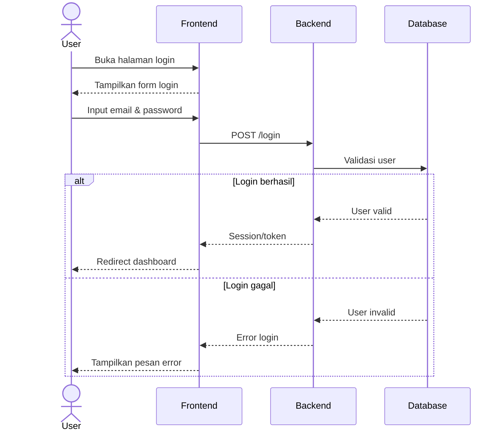
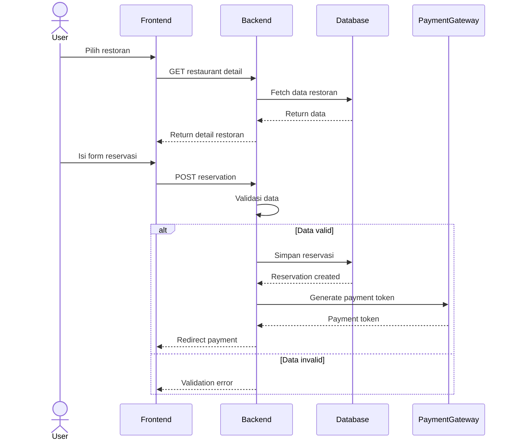
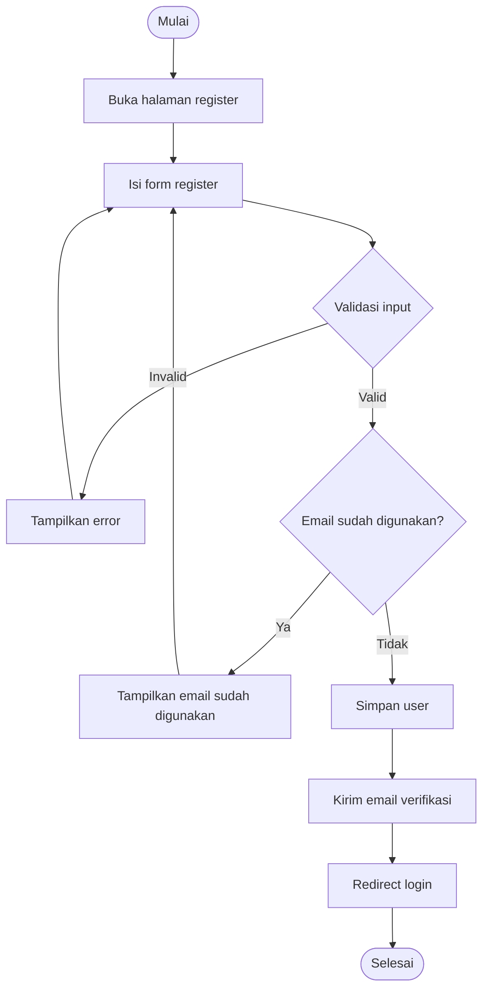
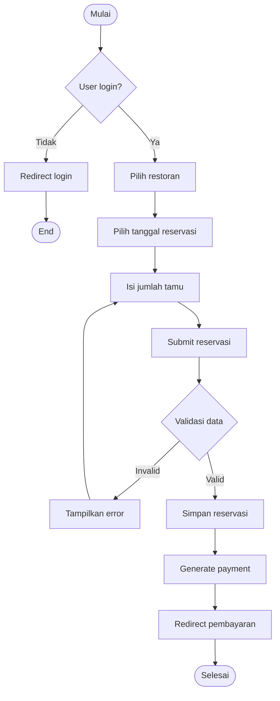
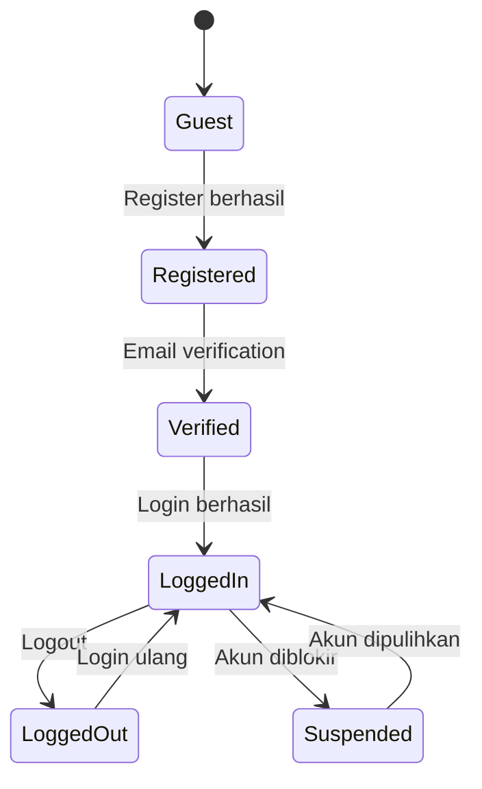
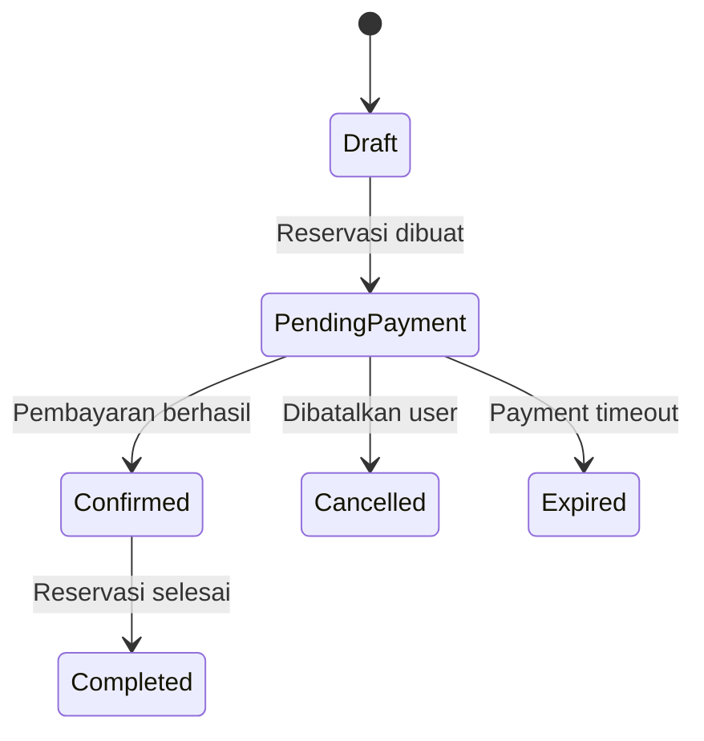
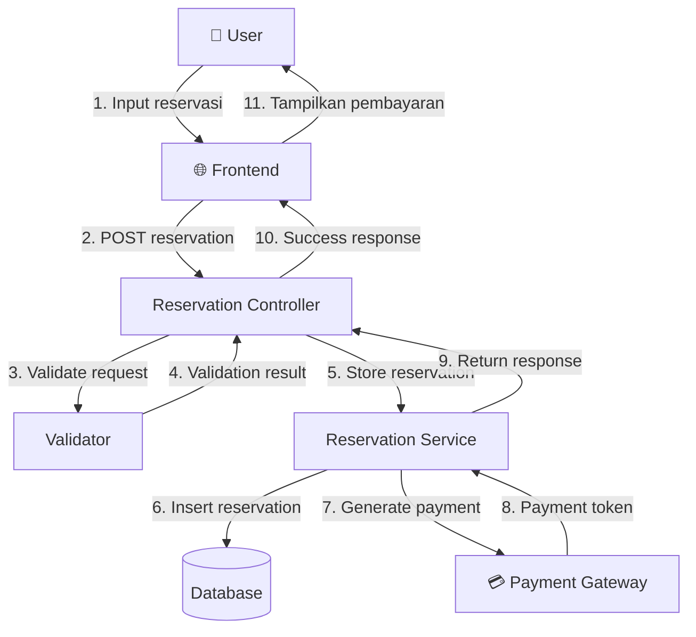

# 🎭 Behaviour Testing (BDD)

> **Model Black Box Testing #7** — *Logic-Based Testing*  
> **Project:** Tempat.in — Restaurant Reservation Platform  
> **Metode:** Black Box Behaviour Testing

---

# 📖 1. Definisi

**Behaviour Testing** (juga dikenal sebagai **Behavior-Driven Development / BDD**) adalah pendekatan pengujian perangkat lunak yang berfokus pada perilaku yang diharapkan dari suatu program dari sudut pandang pengguna.

Metode ini digunakan untuk:
- menguji alur sistem secara end-to-end,
- memastikan interaksi antar modul berjalan sesuai spesifikasi,
- memvalidasi perilaku sistem berdasarkan aksi pengguna.

Pada project **Tempat.in**, Behaviour Testing digunakan untuk menguji keseluruhan flow utama aplikasi reservasi restoran mulai dari registrasi hingga pembayaran reservasi.

---

# 🎯 2. Tujuan Pengujian

| No | Tujuan |
|---|---|
| 1 | Memvalidasi user journey utama aplikasi |
| 2 | Menguji interaksi antar modul sistem |
| 3 | Memastikan state reservation berjalan normal |
| 4 | Menguji validasi autentikasi dan otorisasi |
| 5 | Menguji respons sistem terhadap kondisi gagal |
| 6 | Memastikan proses pembayaran berjalan sesuai flow |

---

# 💻 3. Modul yang Diuji

## User Journey

```text
Register → Verifikasi Email → Login → Cari Restoran → Reservasi → Pembayaran → Riwayat Reservasi
```

---

## Modul Sistem

| Modul | Fungsi |
|---|---|
| Authentication | Login, Register, Logout |
| Email Verification | Aktivasi akun |
| Restaurant Listing | Menampilkan daftar restoran |
| Restaurant Detail | Menampilkan detail restoran |
| Reservation | Membuat reservasi |
| Payment | Pembayaran reservasi |
| Reservation History | Riwayat reservasi user |

---

# 👤 4. Aktor Pengguna

| Aktor | Deskripsi |
|---|---|
| Guest | Pengunjung belum login |
| User | Pengguna terdaftar |
| Verified User | User yang sudah verifikasi email |
| Admin Restaurant | Pengelola restoran |
| Super Admin | Pengelola platform |

---

# 🔷 5. Sequence Diagram

## 5.1 Flow Login User



---

## 5.2 Flow Reservasi Restoran



---

# 🔶 6. Activity Diagram

## 6.1 Activity Diagram — Registrasi User



---

## 6.2 Activity Diagram — Reservasi



---

# 🔵 7. Statechart Diagram

## 7.1 User State



---

## 7.2 Reservation State



---

# 🟣 8. Collaboration Diagram



---

# 🧪 9. BDD Scenario (Gherkin)

```gherkin
Feature: Reservation System
  Sebagai pengguna Tempat.in
  Saya ingin melakukan reservasi restoran
  Agar saya dapat memesan tempat secara online

  Background:
    Given saya memiliki akun yang sudah terverifikasi

  Scenario: Login berhasil
    When saya membuka halaman login
    And saya mengisi email dan password yang valid
    And saya menekan tombol Login
    Then saya diarahkan ke dashboard

  Scenario: Reservasi berhasil
    Given saya sudah login
    When saya memilih restoran
    And saya memilih tanggal reservasi
    And saya memasukkan jumlah tamu
    And saya submit reservasi
    Then reservasi berhasil dibuat
    And saya diarahkan ke halaman pembayaran
```

---

# 📊 10. Hasil Eksekusi

| Scenario | Expected Result | Status |
|---|---|---|
| Login berhasil | Redirect dashboard | ⏳ Pending |
| Reservasi berhasil | Reservation created | ⏳ Pending |
| Pembayaran berhasil | Status confirmed | ⏳ Pending |

---

# 🐛 11. Prediksi Temuan Bug

| ID | Severity | Deskripsi |
|---|---|---|
| BHV-001 | High | User dapat bypass email verification |
| BHV-002 | Medium | Reservation tetap tersimpan saat payment gagal |
| BHV-003 | Medium | Tidak ada validasi double booking |
| BHV-004 | Low | Redirect login tidak konsisten |

---

# 📚 Referensi

1. Suprihadi, D. (2025). Software Quality — Black Box Testing.
2. Myers, G. J. The Art of Software Testing.
3. Laravel Documentation.
4. Mermaid Documentation.
