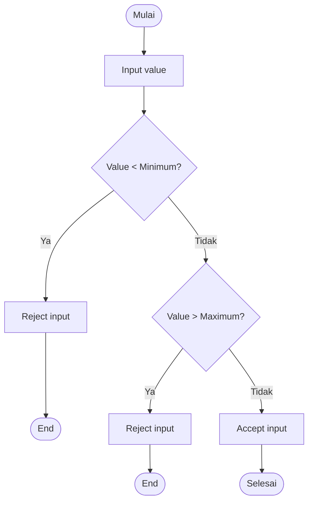

# 📏 Boundary Value Analysis Testing

> **Model Black Box Testing #1** — *Boundary Value Analysis (BVA)*  
> **Project:** Tempat.in — Restaurant Reservation Platform  
> **Metode:** Black Box Testing

---

# 📖 1. Definisi

**Boundary Value Analysis (BVA)** adalah teknik pengujian black box yang berfokus pada pengujian nilai batas (boundary values) dari suatu input.

Metode ini digunakan karena:
- bug sering muncul pada batas minimum dan maksimum,
- validasi sistem biasanya gagal pada edge case,
- boundary condition sering terlewat developer.

Pada project **Tempat.in**, BVA digunakan untuk menguji:
- jumlah tamu,
- panjang input,
- kapasitas reservasi,
- nominal pembayaran,
- panjang password,
- batas tanggal reservasi.

---

# 🎯 2. Tujuan Pengujian

| No | Tujuan |
|---|---|
| 1 | Menguji validasi nilai minimum |
| 2 | Menguji validasi nilai maksimum |
| 3 | Menguji edge case input |
| 4 | Mendeteksi bug pada limit input |
| 5 | Menguji stabilitas validasi sistem |

---

# 💻 3. Modul yang Diuji

| Modul | Fokus Pengujian |
|---|---|
| Login | Panjang password |
| Register | Panjang nama |
| Reservation | Guest count |
| Reservation Date | Batas tanggal |
| Payment | Nominal pembayaran |
| Restaurant Search | Panjang keyword |

---

# 🔷 4. Boundary Value

## 4.1 Password Login/Register

### Constraint
```text
Minimum = 8 karakter
Maximum = 32 karakter
```

### Boundary Test

| Test Value | Status |
|---|---|
| 7 karakter | Invalid |
| 8 karakter | Valid |
| 9 karakter | Valid |
| 31 karakter | Valid |
| 32 karakter | Valid |
| 33 karakter | Invalid |

---

## 4.2 Guest Count Reservation

### Constraint
```text
Minimum = 1 orang
Maximum = 20 orang
```

### Boundary Test

| Test Value | Status |
|---|---|
| 0 | Invalid |
| 1 | Valid |
| 2 | Valid |
| 19 | Valid |
| 20 | Valid |
| 21 | Invalid |

---

## 4.3 Reservation Date

### Constraint
```text
Reservasi minimal H+1
Reservasi maksimal H+30
```

### Boundary Test

| Test Value | Status |
|---|---|
| Hari ini | Invalid |
| H+1 | Valid |
| H+2 | Valid |
| H+29 | Valid |
| H+30 | Valid |
| H+31 | Invalid |

---

## 4.4 Payment Amount

### Constraint
```text
Nominal harus >= total tagihan
```

### Boundary Test

| Test Value | Status |
|---|---|
| Total - 1 | Invalid |
| Total | Valid |
| Total + 1 | Valid |

---

## 4.5 Restaurant Search Keyword

### Constraint
```text
Minimum = 1 karakter
Maximum = 100 karakter
```

### Boundary Test

| Test Value | Status |
|---|---|
| 0 karakter | Invalid |
| 1 karakter | Valid |
| 2 karakter | Valid |
| 99 karakter | Valid |
| 100 karakter | Valid |
| 101 karakter | Invalid |

---

# 🧪 5. Test Case

## 5.1 Password Validation

| TC ID | Input | Expected Result |
|---|---|---|
| BVA-PASS-01 | 7 karakter | Validation error |
| BVA-PASS-02 | 8 karakter | Success |
| BVA-PASS-03 | 32 karakter | Success |
| BVA-PASS-04 | 33 karakter | Validation error |

---

## 5.2 Guest Count Validation

| TC ID | Input | Expected Result |
|---|---|---|
| BVA-GUEST-01 | 0 | Error guest count |
| BVA-GUEST-02 | 1 | Reservasi berhasil |
| BVA-GUEST-03 | 20 | Reservasi berhasil |
| BVA-GUEST-04 | 21 | Error limit guest |

---

## 5.3 Reservation Date Validation

| TC ID | Input | Expected Result |
|---|---|---|
| BVA-DATE-01 | Hari ini | Error date |
| BVA-DATE-02 | H+1 | Success |
| BVA-DATE-03 | H+30 | Success |
| BVA-DATE-04 | H+31 | Error maximum reservation |

---

## 5.4 Payment Validation

| TC ID | Input | Expected Result |
|---|---|---|
| BVA-PAY-01 | Total - 1 | Payment rejected |
| BVA-PAY-02 | Total | Payment success |
| BVA-PAY-03 | Total + 1 | Payment success |

---

# 🔶 6. Activity Diagram

## 6.1 Boundary Validation Flow



---

# 🔵 7. Gherkin Scenario

```gherkin
Feature: Boundary Validation

  Scenario: Password kurang dari minimum
    When user memasukkan password 7 karakter
    Then sistem menolak input password

  Scenario: Password tepat minimum
    When user memasukkan password 8 karakter
    Then sistem menerima password

  Scenario: Guest count melebihi limit
    When user memasukkan jumlah tamu 21
    Then sistem menampilkan error limit guest

  Scenario: Reservasi melebihi H+30
    When user memilih tanggal H+31
    Then sistem menolak reservasi

  Scenario: Payment kurang dari total
    When user membayar kurang dari total tagihan
    Then payment ditolak sistem
```

---

# 📊 8. Hasil Eksekusi

| Test Case | Expected Result | Status |
|---|---|---|
| BVA-PASS-01 | Validation error | ⏳ Pending |
| BVA-PASS-02 | Success | ⏳ Pending |
| BVA-GUEST-04 | Error limit guest | ⏳ Pending |
| BVA-DATE-04 | Error reservation limit | ⏳ Pending |
| BVA-PAY-01 | Payment rejected | ⏳ Pending |

---

# 🐛 9. Prediksi Temuan Bug

| ID | Severity | Deskripsi |
|---|---|---|
| BVA-001 | High | Guest count > 20 masih dapat diproses |
| BVA-002 | Medium | Password 33 karakter tidak tervalidasi |
| BVA-003 | Medium | Reservasi H+31 tetap diterima |
| BVA-004 | Low | Error boundary tidak informatif |

---

# ⚖️ 10. Kelebihan & Kekurangan

## ✅ Kelebihan
- Efektif menemukan edge case bug
- Fokus pada area rawan error
- Sangat cocok untuk validasi form
- Mengurangi risiko overflow input

## ❌ Kekurangan
- Tidak menguji logical flow
- Tidak menguji kombinasi input
- Tidak cukup untuk business logic kompleks

---

# 🛠️ 11. Tools Pendukung

| Tool | Fungsi |
|---|---|
| PHPUnit | Boundary validation testing |
| Postman | API testing |
| Laravel Validator | Input constraint |
| MySQL Constraint | Database validation |

---

# 📚 Referensi

1. Suprihadi, D. (2025). Software Quality — Black Box Testing.
2. Myers, G. J. The Art of Software Testing.
3. Laravel Validation Documentation.
