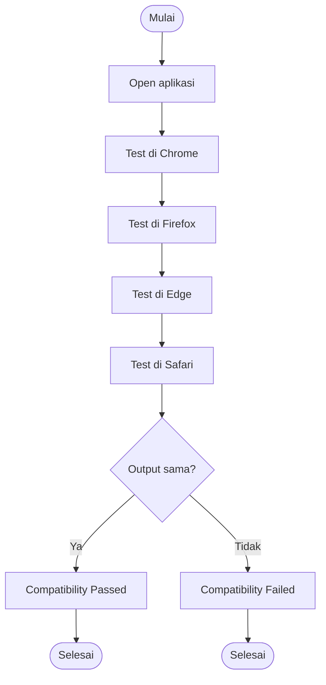

# ⚖️ Comparison Testing

> **Model Black Box Testing #4** — *Comparison Testing*  
> **Project:** Tempat.in — Restaurant Reservation Platform  
> **Metode:** Black Box Testing

---

# 📖 1. Definisi

**Comparison Testing** adalah metode pengujian black box yang digunakan untuk membandingkan hasil output sistem pada kondisi, platform, browser, atau environment yang berbeda.

Metode ini bertujuan untuk:
- memastikan konsistensi sistem,
- menguji kompatibilitas,
- memverifikasi hasil antar platform,
- mendeteksi perbedaan perilaku sistem.

Pada project **Tempat.in**, Comparison Testing digunakan untuk:
- membandingkan tampilan browser,
- membandingkan respons API,
- membandingkan mobile vs desktop,
- membandingkan performa antar environment.

---

# 🎯 2. Tujuan Pengujian

| No | Tujuan |
|---|---|
| 1 | Menguji kompatibilitas browser |
| 2 | Memastikan konsistensi UI |
| 3 | Menguji konsistensi API response |
| 4 | Menguji responsive layout |
| 5 | Mendeteksi perbedaan perilaku sistem |

---

# 💻 3. Modul yang Diuji

| Modul | Fokus Pengujian |
|---|---|
| Authentication | Login consistency |
| Reservation | Flow consistency |
| Payment | Redirect consistency |
| Responsive UI | Mobile vs desktop |
| API Response | JSON consistency |

---

# 🔷 4. Environment Pengujian

## Browser Testing

| Browser | Versi |
|---|---|
| Google Chrome | Latest |
| Mozilla Firefox | Latest |
| Microsoft Edge | Latest |
| Safari | Latest |

---

## Device Testing

| Device | Resolution |
|---|---|
| Desktop | 1920x1080 |
| Tablet | 768x1024 |
| Mobile | 390x844 |

---

# 🔷 5. Comparison Matrix

## 5.1 Login Page Comparison

| Browser | Form Render | Validation | Redirect | Result |
|---|---|---|---|---|
| Chrome | Normal | Normal | Normal | Pass |
| Firefox | Normal | Normal | Normal | Pass |
| Edge | Normal | Normal | Normal | Pass |
| Safari | Layout shift kecil | Normal | Normal | Minor Issue |

---

## 5.2 Reservation Flow Comparison

| Platform | Reservation Form | Payment Redirect | Result |
|---|---|---|---|
| Desktop | Normal | Normal | Pass |
| Tablet | Normal | Normal | Pass |
| Mobile | Button overlap | Normal | Minor Issue |

---

## 5.3 Payment Gateway Comparison

| Browser | Midtrans Popup | Callback | Result |
|---|---|---|---|
| Chrome | Normal | Success | Pass |
| Firefox | Normal | Success | Pass |
| Edge | Normal | Success | Pass |
| Safari | Popup blocked | Failed | Failed |

---

## 5.4 API Response Comparison

| Endpoint | Chrome | Firefox | Edge | Result |
|---|---|---|---|---|
| /login | Same JSON | Same JSON | Same JSON | Pass |
| /reservation | Same JSON | Same JSON | Same JSON | Pass |
| /payment | Same JSON | Same JSON | Same JSON | Pass |

---

# 🧪 6. Test Case

## 6.1 Browser Compatibility Testing

| TC ID | Browser | Expected Result |
|---|---|---|
| CMP-BR-01 | Chrome | UI normal |
| CMP-BR-02 | Firefox | UI normal |
| CMP-BR-03 | Edge | UI normal |
| CMP-BR-04 | Safari | UI normal |

---

## 6.2 Responsive Testing

| TC ID | Device | Expected Result |
|---|---|---|
| CMP-RS-01 | Desktop | Layout responsive |
| CMP-RS-02 | Tablet | Layout responsive |
| CMP-RS-03 | Mobile | Layout responsive |

---

## 6.3 Payment Testing

| TC ID | Browser | Expected Result |
|---|---|---|
| CMP-PAY-01 | Chrome | Payment success |
| CMP-PAY-02 | Firefox | Payment success |
| CMP-PAY-03 | Safari | Payment success |

---

# 🔶 7. Activity Diagram

## 7.1 Browser Comparison Flow



---

# 🔵 8. Gherkin Scenario

```gherkin
Feature: Browser Compatibility

  Scenario: Login page tampil normal di semua browser
    Given user membuka halaman login
    When halaman diuji di Chrome, Firefox, Edge, dan Safari
    Then seluruh elemen tampil konsisten

  Scenario: Reservation flow berjalan normal di mobile
    Given user menggunakan mobile device
    When user membuat reservasi
    Then seluruh button dan form tampil normal

  Scenario: Payment popup berhasil di browser
    Given user melakukan pembayaran
    When payment popup dibuka
    Then popup tampil dan callback berhasil
```

---

# 📊 9. Hasil Eksekusi

| Test Case | Expected Result | Status |
|---|---|---|
| CMP-BR-01 | UI normal | ⏳ Pending |
| CMP-BR-04 | Safari compatibility | ⏳ Pending |
| CMP-RS-03 | Mobile responsive | ⏳ Pending |
| CMP-PAY-03 | Payment success | ⏳ Pending |

---

# 🐛 10. Prediksi Temuan Bug

| ID | Severity | Deskripsi |
|---|---|---|
| CMP-001 | Medium | Layout shift pada Safari |
| CMP-002 | High | Payment popup blocked di Safari |
| CMP-003 | Medium | Button overlap pada mobile |
| CMP-004 | Low | Font rendering berbeda antar browser |

---

# ⚖️ 11. Kelebihan & Kekurangan

## ✅ Kelebihan
- Menguji kompatibilitas sistem
- Menjamin konsistensi UI/UX
- Cocok untuk responsive testing
- Mengurangi browser-specific bug

## ❌ Kekurangan
- Membutuhkan banyak environment
- Waktu testing lebih lama
- Sulit menjaga konsistensi lintas device

---

# 🛠️ 12. Tools Pendukung

| Tool | Fungsi |
|---|---|
| BrowserStack | Cross-browser testing |
| Chrome DevTools | Responsive testing |
| Lighthouse | Performance compare |
| Postman | API comparison |
| Selenium | Automation testing |

---

# 📚 Referensi

1. Suprihadi, D. (2025). Software Quality — Black Box Testing.
2. Myers, G. J. The Art of Software Testing.
3. BrowserStack Documentation.
4. Selenium Documentation.
