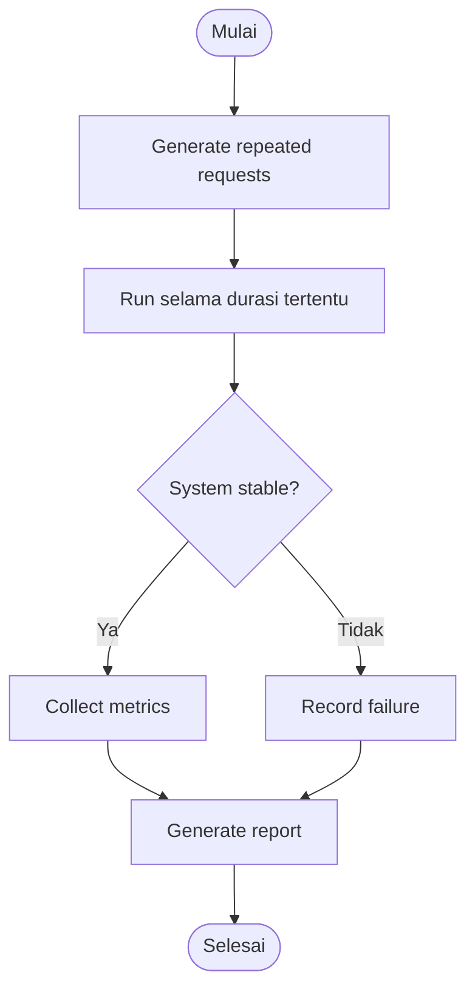

# 🔄 Endurance Testing

> **Model Black Box Testing #9** — *Endurance Testing*  
> **Project:** Tempat.in — Restaurant Reservation Platform  
> **Metode:** Black Box Testing

---

# 📖 1. Definisi

**Endurance Testing** adalah metode pengujian black box yang digunakan untuk menguji kestabilan sistem dalam jangka waktu panjang dengan beban tertentu secara terus-menerus.

Metode ini bertujuan untuk:
- menguji stabilitas aplikasi,
- mendeteksi memory leak,
- menguji performa jangka panjang,
- memastikan sistem tetap berjalan normal setelah digunakan terus-menerus.

Pada project **Tempat.in**, Endurance Testing digunakan untuk:
- menguji reservation system,
- menguji login session,
- menguji payment process,
- menguji API stability,
- menguji database connection.

---

# 🎯 2. Tujuan Pengujian

| No | Tujuan |
|---|---|
| 1 | Menguji kestabilan jangka panjang |
| 2 | Mendeteksi memory leak |
| 3 | Menguji session persistence |
| 4 | Menguji database stability |
| 5 | Menguji performa sistem secara kontinu |

---

# 💻 3. Modul yang Diuji

| Modul | Fokus Pengujian |
|---|---|
| Authentication | Session stability |
| Reservation | Continuous reservation |
| Payment | Continuous payment |
| API Endpoint | Long-duration request |
| Database | Connection stability |

---

# 🔷 4. Parameter Pengujian

| Parameter | Nilai |
|---|---|
| Durasi Testing | 24 jam |
| Concurrent User | 50 user |
| Request Interval | Setiap 5 detik |
| Session Duration | Long session |
| Error Tolerance | < 5% |

---

# 🔷 5. Skenario Endurance Testing

## 5.1 Login Session Testing

| Test ID | Durasi | Expected Result |
|---|---|---|
| END-LOGIN-01 | 1 jam | Session tetap aktif |
| END-LOGIN-02 | 6 jam | Tidak logout otomatis |
| END-LOGIN-03 | 24 jam | Sistem stabil |

---

## 5.2 Continuous Reservation Testing

| Test ID | Jumlah Request | Expected Result |
|---|---|---|
| END-RES-01 | 100 reservasi | Stable |
| END-RES-02 | 1000 reservasi | Tidak ada duplicate |
| END-RES-03 | 24 jam request | Database stabil |

---

## 5.3 Continuous Payment Testing

| Test ID | Jumlah Payment | Expected Result |
|---|---|---|
| END-PAY-01 | 100 payment | Success |
| END-PAY-02 | 500 payment | Callback stabil |
| END-PAY-03 | 24 jam payment | Tidak ada timeout |

---

## 5.4 API Stability Testing

| Test ID | Endpoint | Expected Result |
|---|---|---|
| END-API-01 | /login | Stable |
| END-API-02 | /reservation | Stable |
| END-API-03 | /payment | Stable |
| END-API-04 | /restaurants | Stable |

---

# 🧪 6. Test Case

## 6.1 Session Stability

| TC ID | Durasi | Expected Result |
|---|---|---|
| END-SES-01 | 1 jam | Session aktif |
| END-SES-02 | 6 jam | Tidak logout |
| END-SES-03 | 24 jam | Session tetap valid |

---

## 6.2 Database Stability

| TC ID | Request | Expected Result |
|---|---|---|
| END-DB-01 | 100 insert | Stable |
| END-DB-02 | 1000 insert | Stable |
| END-DB-03 | Continuous query | No disconnect |

---

## 6.3 Reservation Stability

| TC ID | Request | Expected Result |
|---|---|---|
| END-RES-01 | Repeated reservation | Stable |
| END-RES-02 | Concurrent reservation | No duplicate |
| END-RES-03 | Long duration request | Stable |

---

# 🔶 7. Activity Diagram

## 7.1 Continuous Testing Flow



---

# 🔵 8. Gherkin Scenario

```gherkin
Feature: Endurance Stability

  Scenario: Login session tetap aktif
    Given user login ke sistem
    When session digunakan selama 6 jam
    Then session tetap aktif

  Scenario: Reservation stabil selama 24 jam
    Given sistem menerima request reservasi terus-menerus
    When request berjalan selama 24 jam
    Then sistem tetap stabil

  Scenario: Payment callback tidak timeout
    Given payment request berjalan terus-menerus
    When callback diproses selama 24 jam
    Then tidak terjadi timeout

  Scenario: Database connection tetap stabil
    Given sistem melakukan query terus-menerus
    When testing berjalan selama 24 jam
    Then database tetap connected
```

---

# 📊 9. Hasil Eksekusi

| Test Case | Expected Result | Status |
|---|---|---|
| END-SES-01 | Session aktif | ⏳ Pending |
| END-RES-03 | Stable reservation | ⏳ Pending |
| END-PAY-03 | No timeout | ⏳ Pending |
| END-DB-03 | Database stable | ⏳ Pending |

---

# 📈 10. Monitoring Metrics

| Metric | Target |
|---|---|
| Memory Usage | Stabil |
| CPU Usage | < 80% |
| Session Stability | 100% |
| Database Connection | Stable |
| Error Rate | < 5% |
| Request Success Rate | > 95% |

---

# 🐛 11. Prediksi Temuan Bug

| ID | Severity | Deskripsi |
|---|---|---|
| END-001 | High | Memory leak setelah penggunaan lama |
| END-002 | High | Database connection drop |
| END-003 | Medium | Session expired terlalu cepat |
| END-004 | Medium | Payment callback gagal setelah load tinggi |
| END-005 | Low | Response time meningkat perlahan |

---

# ⚖️ 12. Kelebihan & Kekurangan

## ✅ Kelebihan
- Menguji kestabilan real-world
- Mendeteksi memory leak
- Menguji sistem jangka panjang
- Mengurangi risiko downtime

## ❌ Kekurangan
- Membutuhkan waktu lama
- Resource testing besar
- Sulit dilakukan tanpa automation

---

# 🛠️ 13. Tools Pendukung

| Tool | Fungsi |
|---|---|
| Apache JMeter | Long-duration load testing |
| K6 | Continuous request testing |
| Grafana | Monitoring metrics |
| Prometheus | Resource monitoring |
| Laravel Telescope | Application monitoring |

---

# 📚 Referensi

1. Suprihadi, D. (2025). Software Quality — Black Box Testing.
2. Apache JMeter Documentation.
3. Grafana Monitoring Documentation.
4. Myers, G. J. The Art of Software Testing.
