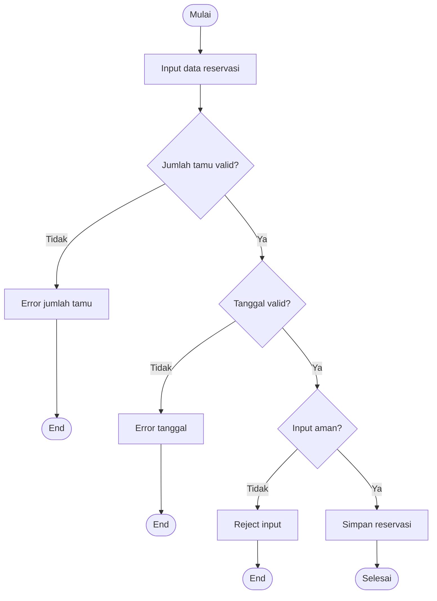

# 🧩 Equivalence Partitioning Testing

> **Model Black Box Testing #2** — *Equivalence Partitioning*  
> **Project:** Tempat.in — Restaurant Reservation Platform  
> **Metode:** Black Box Testing

---

# 📖 1. Definisi

**Equivalence Partitioning** adalah teknik pengujian black box yang membagi data input menjadi beberapa kelas ekuivalensi (equivalence classes), di mana setiap anggota dalam kelas tersebut dianggap menghasilkan perilaku sistem yang sama.

Metode ini bertujuan:
- mengurangi jumlah test case,
- tetap menjaga cakupan pengujian,
- menguji validasi input secara efisien.

Pada project **Tempat.in**, metode ini digunakan untuk menguji:
- form login,
- form registrasi,
- form reservasi,
- pembayaran,
- validasi input user.

---

# 🎯 2. Tujuan Pengujian

| No | Tujuan |
|---|---|
| 1 | Menguji validasi input sistem |
| 2 | Mengelompokkan data valid & invalid |
| 3 | Mengurangi redundant test case |
| 4 | Menguji handling error input |
| 5 | Menguji keamanan validasi form |

---

# 💻 3. Modul yang Diuji

| Modul | Fokus Pengujian |
|---|---|
| Login | Email & password |
| Register | Nama, email, password |
| Reservation | Jumlah tamu, tanggal reservasi |
| Payment | Nominal pembayaran |
| Restaurant Search | Keyword pencarian |

---

# 🔷 4. Equivalence Class

## 4.1 Login Form

| Field | Valid Class | Invalid Class |
|---|---|---|
| Email | Format email valid | Tidak ada `@`, kosong |
| Password | ≥ 8 karakter | < 8 karakter, kosong |

---

## 4.2 Register Form

| Field | Valid Class | Invalid Class |
|---|---|---|
| Name | Huruf normal | Simbol berlebih |
| Email | Email unik valid | Email duplicate |
| Password | ≥ 8 karakter | Password pendek |

---

## 4.3 Reservation Form

| Field | Valid Class | Invalid Class |
|---|---|---|
| Guest Count | 1–20 orang | 0, negatif |
| Reservation Date | Hari mendatang | Tanggal lampau |
| Notes | Text normal | Script injection |

---

## 4.4 Payment Form

| Field | Valid Class | Invalid Class |
|---|---|---|
| Payment Amount | Sesuai total tagihan | Kurang dari tagihan |
| Payment Token | Token valid | Token invalid |

---

# 🧪 5. Test Case

## 5.1 Login Testing

| TC ID | Input | Class | Expected Result |
|---|---|---|---|
| EQ-LOGIN-01 | user@mail.com + password valid | Valid | Login berhasil |
| EQ-LOGIN-02 | email tanpa @ | Invalid | Error email |
| EQ-LOGIN-03 | password kosong | Invalid | Error password |
| EQ-LOGIN-04 | email kosong | Invalid | Error validation |

---

## 5.2 Register Testing

| TC ID | Input | Class | Expected Result |
|---|---|---|---|
| EQ-REG-01 | Semua field valid | Valid | Register berhasil |
| EQ-REG-02 | Email duplicate | Invalid | Error duplicate |
| EQ-REG-03 | Password pendek | Invalid | Error password |
| EQ-REG-04 | Nama kosong | Invalid | Error validation |

---

## 5.3 Reservation Testing

| TC ID | Input | Class | Expected Result |
|---|---|---|---|
| EQ-RES-01 | Guest = 4 | Valid | Reservasi berhasil |
| EQ-RES-02 | Guest = 0 | Invalid | Error jumlah tamu |
| EQ-RES-03 | Tanggal lampau | Invalid | Error tanggal |
| EQ-RES-04 | Notes normal | Valid | Reservasi berhasil |
| EQ-RES-05 | Script injection | Invalid | Input ditolak |

---

## 5.4 Payment Testing

| TC ID | Input | Class | Expected Result |
|---|---|---|---|
| EQ-PAY-01 | Amount sesuai tagihan | Valid | Payment success |
| EQ-PAY-02 | Amount kurang | Invalid | Payment rejected |
| EQ-PAY-03 | Token invalid | Invalid | Error payment |

---

# 🔶 6. Activity Diagram

## 6.1 Validasi Reservation Input



---

# 🔵 7. Gherkin Scenario

```gherkin
Feature: Input Validation

  Scenario: Login berhasil
    Given user memiliki akun valid
    When user memasukkan email dan password valid
    Then sistem mengarahkan ke dashboard

  Scenario: Login gagal karena email invalid
    When user memasukkan email tanpa format valid
    Then sistem menampilkan error email

  Scenario: Reservasi gagal karena jumlah tamu kosong
    Given user sudah login
    When user submit form reservasi tanpa jumlah tamu
    Then sistem menampilkan validasi error

  Scenario: Payment gagal karena nominal kurang
    Given user memiliki tagihan reservasi
    When user membayar kurang dari total tagihan
    Then payment ditolak sistem
```

---

# 📊 8. Hasil Eksekusi

| Test Case | Expected Result | Status |
|---|---|---|
| EQ-LOGIN-01 | Login berhasil | ⏳ Pending |
| EQ-LOGIN-02 | Error email | ⏳ Pending |
| EQ-REG-01 | Register berhasil | ⏳ Pending |
| EQ-RES-02 | Error jumlah tamu | ⏳ Pending |
| EQ-PAY-02 | Payment rejected | ⏳ Pending |

---

# 🐛 9. Prediksi Temuan Bug

| ID | Severity | Deskripsi |
|---|---|---|
| EQ-001 | Medium | Validasi email tidak konsisten |
| EQ-002 | High | Input script dapat lolos pada notes reservasi |
| EQ-003 | Medium | Guest count negatif masih diterima |
| EQ-004 | Low | Error message tidak informatif |

---

# ⚖️ 10. Kelebihan & Kekurangan

## ✅ Kelebihan
- Mengurangi jumlah test case
- Efisien untuk validasi input
- Mudah diterapkan pada form system
- Cocok untuk pengujian CRUD

## ❌ Kekurangan
- Tidak menguji boundary detail
- Tidak mendeteksi logical flow bug
- Tidak cocok untuk state transition

---

# 🛠️ 11. Tools Pendukung

| Tool | Fungsi |
|---|---|
| PHPUnit | Validation testing |
| Postman | API validation |
| Laravel Validation | Input filtering |
| MySQL | Database constraint |

---

# 📚 Referensi

1. Suprihadi, D. (2025). Software Quality — Black Box Testing.
2. Myers, G. J. The Art of Software Testing.
3. Laravel Validation Documentation.
