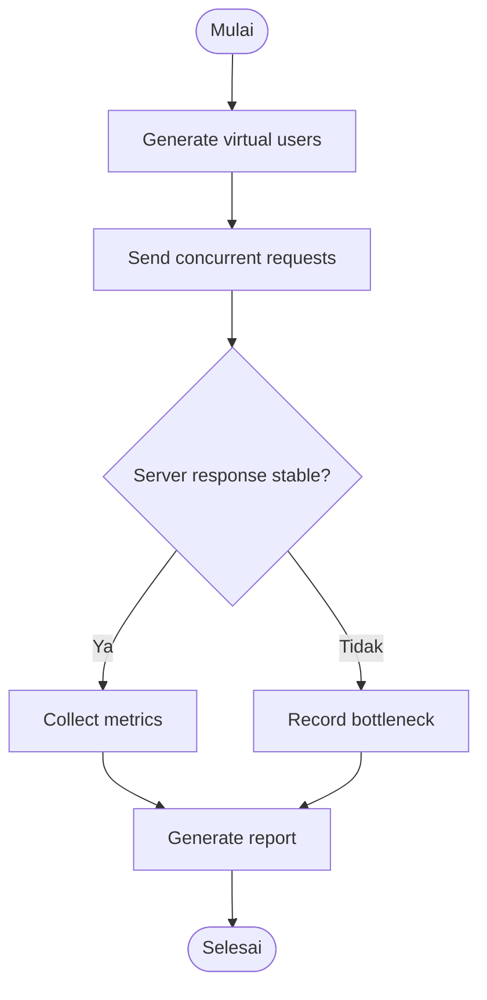

# 🚀 Performance Testing

> **Model Black Box Testing #8** — *Performance Testing*  
> **Project:** Tempat.in — Restaurant Reservation Platform  
> **Metode:** Black Box Testing

---

# 📖 1. Definisi

**Performance Testing** adalah metode pengujian black box yang digunakan untuk mengukur performa sistem dalam kondisi tertentu.

Metode ini bertujuan untuk:
- menguji kecepatan sistem,
- mengukur response time,
- menguji scalability,
- menguji stabilitas server,
- memastikan aplikasi tetap responsif.

Pada project **Tempat.in**, Performance Testing digunakan untuk:
- menguji performa login,
- menguji reservation request,
- menguji payment process,
- menguji loading halaman restoran,
- menguji performa API.

---

# 🎯 2. Tujuan Pengujian

| No | Tujuan |
|---|---|
| 1 | Mengukur response time aplikasi |
| 2 | Menguji kestabilan server |
| 3 | Menguji performa API |
| 4 | Mengukur kemampuan concurrent user |
| 5 | Mengidentifikasi bottleneck sistem |

---

# 💻 3. Modul yang Diuji

| Modul | Fokus Pengujian |
|---|---|
| Authentication | Login performance |
| Reservation | Reservation request |
| Restaurant Listing | Data loading |
| Payment | Payment processing |
| API Endpoint | API response time |

---

# 🔷 4. Parameter Pengujian

| Parameter | Target |
|---|---|
| Response Time | < 3 detik |
| API Response | < 1 detik |
| Concurrent User | 100 user |
| Error Rate | < 5% |
| CPU Usage | Stabil |
| Memory Usage | Stabil |

---

# 🔷 5. Skenario Performance Testing

## 5.1 Login Performance

| Test ID | Concurrent User | Expected Result |
|---|---|---|
| PERF-LOGIN-01 | 10 user | Login normal |
| PERF-LOGIN-02 | 50 user | Response < 3s |
| PERF-LOGIN-03 | 100 user | Server tetap stabil |

---

## 5.2 Reservation Performance

| Test ID | Concurrent User | Expected Result |
|---|---|---|
| PERF-RES-01 | 20 user | Reservasi berhasil |
| PERF-RES-02 | 50 user | Tidak ada duplicate booking |
| PERF-RES-03 | 100 user | Response stabil |

---

## 5.3 Restaurant Listing Performance

| Test ID | Data Volume | Expected Result |
|---|---|---|
| PERF-LIST-01 | 100 restoran | Loading cepat |
| PERF-LIST-02 | 1000 restoran | Pagination normal |
| PERF-LIST-03 | Search keyword | Response < 1s |

---

## 5.4 Payment Performance

| Test ID | Concurrent Request | Expected Result |
|---|---|---|
| PERF-PAY-01 | 10 payment | Payment success |
| PERF-PAY-02 | 50 payment | Callback normal |
| PERF-PAY-03 | 100 payment | Tidak ada timeout |

---

# 🧪 6. Test Case

## 6.1 API Response Testing

| TC ID | Endpoint | Expected Result |
|---|---|---|
| PERF-API-01 | /login | Response < 1s |
| PERF-API-02 | /restaurants | Response < 1s |
| PERF-API-03 | /reservation | Response < 2s |
| PERF-API-04 | /payment | Response < 3s |

---

## 6.2 Concurrent User Testing

| TC ID | User Count | Expected Result |
|---|---|---|
| PERF-CON-01 | 10 | Stable |
| PERF-CON-02 | 50 | Stable |
| PERF-CON-03 | 100 | Stable |
| PERF-CON-04 | 200 | No crash |

---

# 🔶 7. Activity Diagram

## 7.1 Performance Load Flow



---

# 🔵 8. Gherkin Scenario

```gherkin
Feature: System Performance

  Scenario: Login performance normal
    Given 50 user mengakses login bersamaan
    When seluruh user melakukan login
    Then response time kurang dari 3 detik

  Scenario: Reservation request stabil
    Given 100 user melakukan reservasi
    When request dikirim secara bersamaan
    Then sistem tetap stabil

  Scenario: Restaurant listing cepat
    Given database memiliki 1000 restoran
    When user membuka halaman restoran
    Then data tampil kurang dari 1 detik

  Scenario: Payment callback berhasil
    Given user melakukan pembayaran
    When payment callback diproses
    Then status payment berubah tanpa timeout
```

---

# 📊 9. Hasil Eksekusi

| Test Case | Expected Result | Status |
|---|---|---|
| PERF-API-01 | Response < 1s | ⏳ Pending |
| PERF-RES-03 | Stable reservation | ⏳ Pending |
| PERF-PAY-03 | No timeout | ⏳ Pending |
| PERF-CON-04 | No crash | ⏳ Pending |

---

# 📈 10. Metrik Pengujian

| Metric | Target |
|---|---|
| Avg Response Time | < 2s |
| Peak Response Time | < 5s |
| Throughput | Stabil |
| Error Rate | < 5% |
| CPU Usage | < 80% |
| RAM Usage | Stabil |

---

# 🐛 11. Prediksi Temuan Bug

| ID | Severity | Deskripsi |
|---|---|---|
| PERF-001 | High | Duplicate reservation saat concurrent request |
| PERF-002 | High | Payment callback timeout |
| PERF-003 | Medium | API response melambat saat 100 user |
| PERF-004 | Medium | Search restoran lambat pada dataset besar |
| PERF-005 | Low | UI freeze pada mobile device |

---

# ⚖️ 12. Kelebihan & Kekurangan

## ✅ Kelebihan
- Mengukur performa real system
- Mengidentifikasi bottleneck
- Menguji scalability
- Mengurangi risiko server crash

## ❌ Kekurangan
- Membutuhkan resource besar
- Testing environment harus stabil
- Sulit mensimulasikan traffic real-world

---

# 🛠️ 13. Tools Pendukung

| Tool | Fungsi |
|---|---|
| Apache JMeter | Load testing |
| K6 | Performance testing |
| Lighthouse | Frontend performance |
| Postman Runner | API stress testing |
| Laravel Telescope | Monitoring |

---

# 📚 Referensi

1. Suprihadi, D. (2025). Software Quality — Black Box Testing.
2. Apache JMeter Documentation.
3. K6 Performance Testing Documentation.
4. Myers, G. J. The Art of Software Testing.
