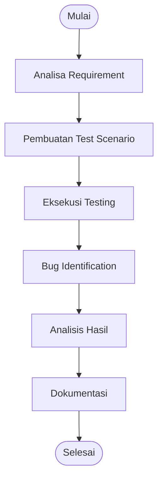

# 🧪 Black Box Testing Documentation  
## Project: Tempat.in — Restaurant Reservation Platform

---

# 📖 Deskripsi

Dokumentasi ini berisi seluruh proses pengujian **Black Box Testing** pada project **Tempat.in**, yaitu platform reservasi restoran berbasis web.

Metode Black Box Testing digunakan untuk menguji:
- perilaku sistem,
- validasi input,
- business logic,
- performa,
- stabilitas aplikasi,

tanpa melihat implementasi internal source code secara detail.

---

# 🎯 Tujuan Pengujian

Tujuan utama dokumentasi ini adalah:

- Memastikan seluruh fitur berjalan sesuai requirement.
- Menguji interaksi sistem dari perspektif pengguna.
- Mengidentifikasi bug pada validasi input dan business process.
- Menguji performa dan stabilitas aplikasi.
- Menyediakan dokumentasi Software Quality Assurance (SQA).

---

# 🧩 Metode Black Box Testing yang Digunakan

| No | Metode | File Dokumentasi |
|---|---|---|
| 1 | Behaviour Testing | `Behaviour-Testing.md` |
| 2 | Equivalence Partitioning | `Equivalence-Partitioning.md` |
| 3 | Boundary Value Analysis | `Boundary-Value-Analysis.md` |
| 4 | Decision Table Testing | `Decision-Table-Testing.md` |
| 5 | Comparison Testing | `Comparison-Testing.md` |
| 6 | Sample Testing | `Sample-Testing.md` |
| 7 | Robustness Testing | `Robustness-Testing.md` |
| 8 | Performance Testing | `Performance-Testing.md` |
| 9 | Endurance Testing | `Endurance-Testing.md` |

---

# 💻 Modul Sistem yang Diuji

| Modul | Deskripsi |
|---|---|
| Authentication | Login, Register, Logout |
| Reservation | Reservasi restoran |
| Payment | Pembayaran reservasi |
| Restaurant Listing | Daftar restoran |
| Restaurant Search | Pencarian restoran |
| Reservation History | Riwayat reservasi |
| Session Management | Pengelolaan autentikasi |
| Responsive UI | Tampilan multi-device |

---

# 🔍 Ruang Lingkup Pengujian

## Functional Testing
- Login & Register
- Reservation Flow
- Payment Flow
- Search Feature

## Validation Testing
- Input validation
- Boundary validation
- Invalid payload testing

## Compatibility Testing
- Browser compatibility
- Responsive layout
- API consistency

## Stability Testing
- Load testing
- Continuous request testing
- Session endurance

---

# 🛠️ Tools Pengujian

| Tool | Fungsi |
|---|---|
| PHPUnit | Functional Testing |
| Postman | API Testing |
| Laravel Dusk | Browser Automation |
| Apache JMeter | Load Testing |
| K6 | Performance Testing |
| BrowserStack | Cross-browser Testing |
| OWASP ZAP | Security Testing |
| Lighthouse | Frontend Performance |

---

# 📂 Struktur Dokumentasi

```text
BlackBox/
│
├── README.md
├── Behaviour-Testing.md
├── Equivalence-Partitioning.md
├── Boundary-Value-Analysis.md
├── Decision-Table-Testing.md
├── Comparison-Testing.md
├── Sample-Testing.md
├── Robustness-Testing.md
├── Performance-Testing.md
└── Endurance-Testing.md
```

---

# 🔄 Alur Pengujian



---

# 📊 Fokus Pengujian

| Fokus | Metode |
|---|---|
| User Behaviour | Behaviour Testing |
| Input Validation | Equivalence Partitioning |
| Boundary Validation | Boundary Value Analysis |
| Business Logic | Decision Table Testing |
| Compatibility | Comparison Testing |
| Representative Data | Sample Testing |
| Invalid Input & Security | Robustness Testing |
| System Speed | Performance Testing |
| Long-Term Stability | Endurance Testing |

---

# 🐛 Jenis Bug yang Ditargetkan

- Validation Bug
- Logic Bug
- UI Bug
- Compatibility Bug
- Performance Bottleneck
- Session Bug
- Security Vulnerability
- Database Constraint Error
- Concurrency Issue

---

# ⚖️ Kelebihan Black Box Testing

## ✅ Kelebihan
- Menguji sistem dari perspektif pengguna.
- Tidak bergantung pada source code internal.
- Cocok untuk validasi requirement.
- Mudah dipahami stakeholder non-teknis.
- Efektif untuk functional testing.

## ❌ Kekurangan
- Tidak menguji internal logic secara detail.
- Sulit mendeteksi hidden code issue.
- Coverage bergantung pada kualitas test case.
- Membutuhkan banyak skenario pengujian.

---

# 📚 Referensi

1. Suprihadi, D. (2025). *Software Quality — Black Box Testing*.
2. Myers, G. J. *The Art of Software Testing*.
3. Laravel Documentation.
4. OWASP Testing Guide.
5. Apache JMeter Documentation.
6. BrowserStack Documentation.

---

# 👨‍💻 Project Information

| Item | Detail |
|---|---|
| Project | Tempat.in |
| Type | Restaurant Reservation Platform |
| Framework | Laravel |
| Database | MySQL |
| Testing Method | Black Box Testing |
| Documentation Format | Markdown (.md) |

---

# 🚀 Kesimpulan

Berdasarkan seluruh metode Black Box Testing yang dilakukan, sistem **Tempat.in** diuji dari berbagai aspek:
- functionality,
- validation,
- compatibility,
- robustness,
- performance,
- endurance.

Pendekatan ini membantu memastikan bahwa aplikasi mampu berjalan sesuai requirement serta tetap stabil dalam berbagai kondisi penggunaan.
