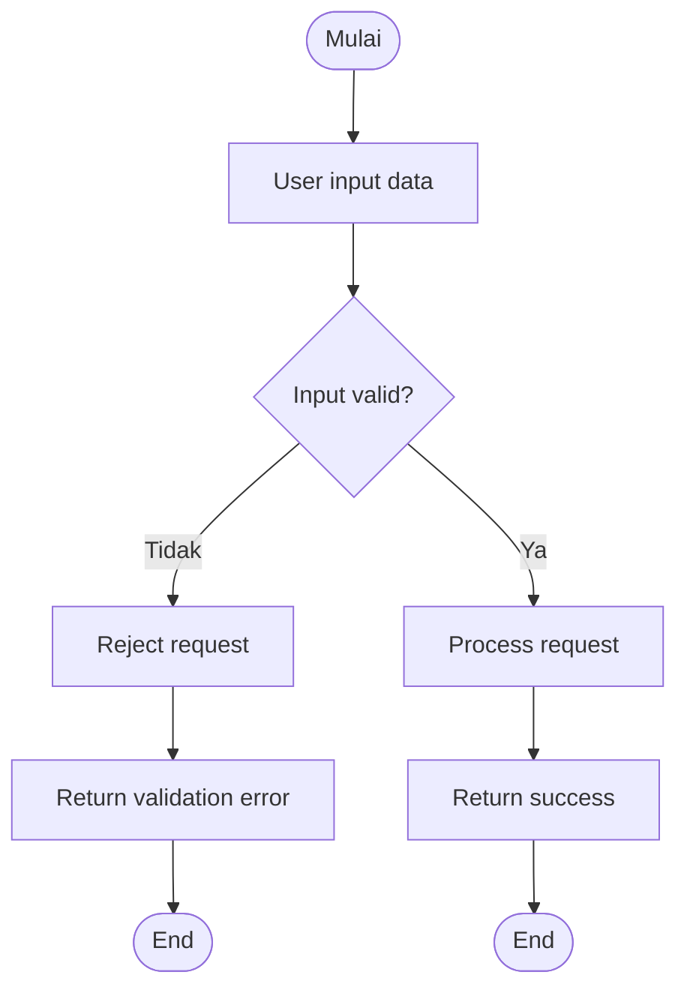

# 🛡️ Robustness Testing

> **Model Black Box Testing #6** — *Robustness Testing*  
> **Project:** Tempat.in — Restaurant Reservation Platform  
> **Metode:** Black Box Testing

---

# 📖 1. Definisi

**Robustness Testing** adalah metode pengujian black box yang digunakan untuk menguji bagaimana sistem menangani input tidak valid, data ekstrem, dan kondisi abnormal.

Metode ini bertujuan untuk:
- menguji ketahanan sistem,
- memastikan aplikasi tidak crash,
- memvalidasi keamanan input,
- menguji handling error sistem.

Pada project **Tempat.in**, Robustness Testing digunakan untuk menguji:
- invalid input,
- SQL Injection,
- XSS Injection,
- session manipulation,
- payload berukuran besar,
- malformed request.

---

# 🎯 2. Tujuan Pengujian

| No | Tujuan |
|---|---|
| 1 | Menguji ketahanan aplikasi |
| 2 | Menguji handling invalid input |
| 3 | Menguji keamanan sistem |
| 4 | Mendeteksi crash/error |
| 5 | Menguji validasi backend |

---

# 💻 3. Modul yang Diuji

| Modul | Fokus Pengujian |
|---|---|
| Authentication | Invalid login |
| Reservation | Invalid reservation input |
| Search | Malicious keyword |
| Payment | Invalid payment request |
| Session | Session tampering |

---

# 🔷 4. Jenis Robustness Testing

| Jenis | Deskripsi |
|---|---|
| Invalid Input | Input kosong / format salah |
| SQL Injection | Manipulasi query SQL |
| XSS Injection | Inject script HTML/JS |
| Large Payload | Input ukuran besar |
| Session Manipulation | Manipulasi session/token |
| Malformed Request | Struktur request rusak |

---

# 🧪 5. Test Case

## 5.1 Invalid Login Input

| TC ID | Input | Expected Result |
|---|---|---|
| ROB-LOGIN-01 | Email kosong | Validation error |
| ROB-LOGIN-02 | Password kosong | Validation error |
| ROB-LOGIN-03 | Email tanpa @ | Validation error |
| ROB-LOGIN-04 | Password sangat panjang | Reject input |

---

## 5.2 SQL Injection Testing

| TC ID | Input | Expected Result |
|---|---|---|
| ROB-SQL-01 | `' OR 1=1 --` | Input rejected |
| ROB-SQL-02 | `admin'--` | Authentication failed |
| ROB-SQL-03 | `DROP TABLE users` | Input sanitized |

---

## 5.3 XSS Injection Testing

| TC ID | Input | Expected Result |
|---|---|---|
| ROB-XSS-01 | `<script>alert(1)</script>` | Script blocked |
| ROB-XSS-02 | `` | Input sanitized |
| ROB-XSS-03 | `<iframe>` injection | Reject input |

---

## 5.4 Reservation Payload Testing

| TC ID | Input | Expected Result |
|---|---|---|
| ROB-RES-01 | Guest count negatif | Validation error |
| ROB-RES-02 | Guest count 9999 | Reject input |
| ROB-RES-03 | Notes 10.000 karakter | Reject payload |
| ROB-RES-04 | Invalid date format | Validation error |

---

## 5.5 Session Manipulation Testing

| TC ID | Input | Expected Result |
|---|---|---|
| ROB-SES-01 | Expired token | Redirect login |
| ROB-SES-02 | Fake token | Unauthorized |
| ROB-SES-03 | Manipulated session | Session invalid |

---

# 🔶 6. Activity Diagram

## 6.1 Invalid Input Handling



---

# 🔵 7. Gherkin Scenario

```gherkin
Feature: Robustness Validation

  Scenario: Login dengan email invalid
    When user memasukkan email tanpa format valid
    Then sistem menampilkan validation error

  Scenario: SQL Injection login
    When user memasukkan "' OR 1=1 --"
    Then sistem menolak login request

  Scenario: XSS Injection pada notes reservasi
    Given user membuka form reservasi
    When user memasukkan script HTML
    Then sistem melakukan sanitasi input

  Scenario: Payload terlalu besar
    When user mengirim notes 10000 karakter
    Then sistem menolak request

  Scenario: Session token palsu
    When user menggunakan fake token
    Then sistem mengembalikan unauthorized response
```

---

# 📊 8. Hasil Eksekusi

| Test Case | Expected Result | Status |
|---|---|---|
| ROB-LOGIN-01 | Validation error | ⏳ Pending |
| ROB-SQL-01 | Input rejected | ⏳ Pending |
| ROB-XSS-01 | Script blocked | ⏳ Pending |
| ROB-RES-03 | Reject payload | ⏳ Pending |
| ROB-SES-02 | Unauthorized | ⏳ Pending |

---

# 🐛 9. Prediksi Temuan Bug

| ID | Severity | Deskripsi |
|---|---|---|
| ROB-001 | High | SQL Injection masih dapat bypass login |
| ROB-002 | High | XSS injection tampil pada reservation history |
| ROB-003 | Medium | Payload besar menyebabkan slow response |
| ROB-004 | Medium | Session token invalid tidak langsung logout |
| ROB-005 | Low | Error validation menampilkan raw exception |

---

# ⚖️ 10. Kelebihan & Kekurangan

## ✅ Kelebihan
- Menguji ketahanan aplikasi
- Mendeteksi security issue
- Mengurangi risiko crash
- Cocok untuk stress input validation

## ❌ Kekurangan
- Membutuhkan banyak variasi input
- Tidak menguji business logic detail
- Sulit mengukur seluruh edge case

---

# 🛠️ 11. Tools Pendukung

| Tool | Fungsi |
|---|---|
| OWASP ZAP | Security testing |
| Burp Suite | Injection testing |
| Postman | Invalid payload testing |
| PHPUnit | Backend validation |
| Laravel Middleware | Security filtering |

---

# 📚 Referensi

1. Suprihadi, D. (2025). Software Quality — Black Box Testing.
2. OWASP Testing Guide.
3. Myers, G. J. The Art of Software Testing.
4. Laravel Security Documentation.
