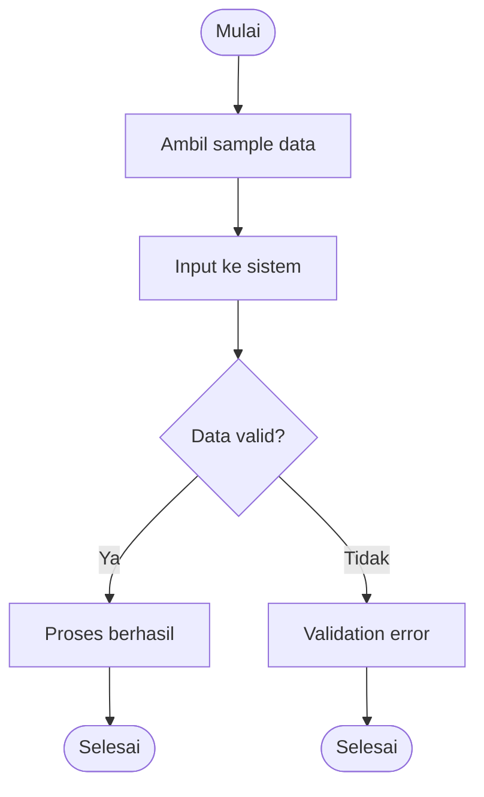

# 🧪 Sample Testing

> **Model Black Box Testing #5** — *Sample Testing*  
> **Project:** Tempat.in — Restaurant Reservation Platform  
> **Metode:** Black Box Testing

---

# 📖 1. Definisi

**Sample Testing** adalah metode pengujian black box yang dilakukan dengan mengambil beberapa sampel data dari kelompok input tertentu untuk mewakili keseluruhan data.

Metode ini digunakan untuk:
- mengurangi jumlah pengujian,
- menguji data representatif,
- memvalidasi perilaku sistem terhadap berbagai variasi input.

Pada project **Tempat.in**, Sample Testing digunakan untuk:
- pengujian data reservasi,
- pengujian akun user,
- pengujian pembayaran,
- pengujian pencarian restoran,
- pengujian data transaksi.

---

# 🎯 2. Tujuan Pengujian

| No | Tujuan |
|---|---|
| 1 | Menguji data representatif |
| 2 | Mengurangi jumlah test case |
| 3 | Menguji stabilitas sistem |
| 4 | Menguji variasi input user |
| 5 | Mengidentifikasi bug pada data tertentu |

---

# 💻 3. Modul yang Diuji

| Modul | Fokus Pengujian |
|---|---|
| Authentication | Data login user |
| Reservation | Data reservasi |
| Restaurant Search | Keyword pencarian |
| Payment | Data pembayaran |
| Reservation History | Data transaksi user |

---

# 🔷 4. Sample Data Pengujian

## 4.1 Sample Login User

| Sample ID | Email | Password | Expected Result |
|---|---|---|---|
| S-LOGIN-01 | user1@mail.com | Password123 | Login berhasil |
| S-LOGIN-02 | admin@mail.com | Admin123 | Login berhasil |
| S-LOGIN-03 | invalid@mail | Password123 | Error validation |
| S-LOGIN-04 | kosong | kosong | Error validation |

---

## 4.2 Sample Reservation Data

| Sample ID | Guest Count | Date | Expected Result |
|---|---|---|---|
| S-RES-01 | 2 | H+1 | Success |
| S-RES-02 | 10 | H+7 | Success |
| S-RES-03 | 0 | H+1 | Validation error |
| S-RES-04 | 25 | H+3 | Guest limit error |
| S-RES-05 | 4 | Tanggal lampau | Invalid date |

---

## 4.3 Sample Payment Data

| Sample ID | Nominal | Status |
|---|---|---|
| S-PAY-01 | Sesuai tagihan | Success |
| S-PAY-02 | Kurang tagihan | Rejected |
| S-PAY-03 | Lebih tagihan | Success |
| S-PAY-04 | Token invalid | Failed |

---

## 4.4 Sample Restaurant Search

| Sample ID | Keyword | Expected Result |
|---|---|---|
| S-SRC-01 | Sushi | Menampilkan restoran |
| S-SRC-02 | Steak | Menampilkan restoran |
| S-SRC-03 | "" | Validation error |
| S-SRC-04 | karakter random | Empty result |

---

# 🧪 5. Test Case

## 5.1 Login Testing

| TC ID | Sample | Expected Result |
|---|---|---|
| SMP-LOGIN-01 | User valid | Login berhasil |
| SMP-LOGIN-02 | Email invalid | Validation error |
| SMP-LOGIN-03 | Empty field | Validation error |

---

## 5.2 Reservation Testing

| TC ID | Sample | Expected Result |
|---|---|---|
| SMP-RES-01 | Guest normal | Reservasi berhasil |
| SMP-RES-02 | Guest berlebih | Error limit |
| SMP-RES-03 | Tanggal lampau | Error tanggal |

---

## 5.3 Payment Testing

| TC ID | Sample | Expected Result |
|---|---|---|
| SMP-PAY-01 | Nominal sesuai | Payment success |
| SMP-PAY-02 | Nominal kurang | Payment failed |
| SMP-PAY-03 | Token invalid | Payment failed |

---

# 🔶 6. Activity Diagram

## 6.1 Sample Input Validation



---

# 🔵 7. Gherkin Scenario

```gherkin
Feature: Sample Data Testing

  Scenario: Login menggunakan sample user valid
    Given user memiliki akun valid
    When user login menggunakan sample data valid
    Then sistem mengarahkan ke dashboard

  Scenario: Reservasi menggunakan sample invalid
    Given user sudah login
    When user memasukkan jumlah tamu melebihi limit
    Then sistem menampilkan error validation

  Scenario: Payment menggunakan sample nominal kurang
    Given user memiliki tagihan reservasi
    When user membayar kurang dari nominal
    Then payment gagal

  Scenario: Search restoran menggunakan sample keyword
    When user mencari restoran menggunakan keyword "Sushi"
    Then sistem menampilkan daftar restoran terkait
```

---

# 📊 8. Hasil Eksekusi

| Test Case | Expected Result | Status |
|---|---|---|
| SMP-LOGIN-01 | Login berhasil | ⏳ Pending |
| SMP-LOGIN-02 | Validation error | ⏳ Pending |
| SMP-RES-02 | Error limit | ⏳ Pending |
| SMP-PAY-02 | Payment failed | ⏳ Pending |
| SMP-SRC-01 | Search result muncul | ⏳ Pending |

---

# 🐛 9. Prediksi Temuan Bug

| ID | Severity | Deskripsi |
|---|---|---|
| SMP-001 | Medium | Search kosong tetap memproses query |
| SMP-002 | High | Guest limit dapat dibypass |
| SMP-003 | Medium | Payment nominal negatif diterima |
| SMP-004 | Low | Error validation tidak konsisten |

---

# ⚖️ 10. Kelebihan & Kekurangan

## ✅ Kelebihan
- Mengurangi jumlah pengujian
- Cepat dan efisien
- Cocok untuk validasi umum
- Mudah diterapkan

## ❌ Kekurangan
- Tidak menguji seluruh kombinasi data
- Risiko bug tidak terdeteksi
- Bergantung pada kualitas sample

---

# 🛠️ 11. Tools Pendukung

| Tool | Fungsi |
|---|---|
| PHPUnit | Functional testing |
| Postman | API testing |
| Faker | Generate sample data |
| Laravel Seeder | Dummy data |

---

# 📚 Referensi

1. Suprihadi, D. (2025). Software Quality — Black Box Testing.
2. Myers, G. J. The Art of Software Testing.
3. Laravel Testing Documentation.
