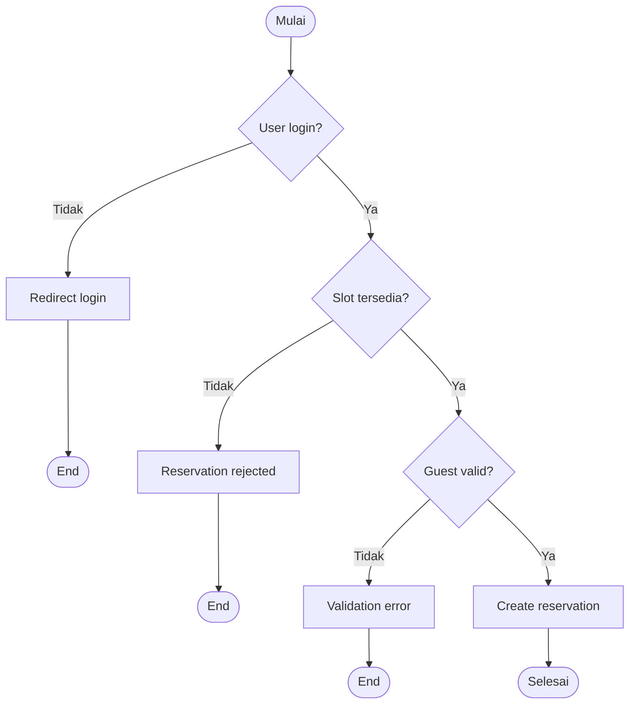

# 🧠 Decision Table Testing

> **Model Black Box Testing #3** — *Decision Table Testing*  
> **Project:** Tempat.in — Restaurant Reservation Platform  
> **Metode:** Black Box Testing

---

# 📖 1. Definisi

**Decision Table Testing** adalah teknik pengujian black box yang digunakan untuk menguji kombinasi kondisi dan aksi dalam suatu sistem.

Metode ini digunakan ketika:
- sistem memiliki banyak rule,
- terdapat kombinasi kondisi,
- terdapat keputusan berbeda berdasarkan input tertentu.

Pada project **Tempat.in**, metode ini digunakan untuk menguji:
- login authentication,
- reservation flow,
- payment validation,
- role access,
- reservation confirmation.

---

# 🎯 2. Tujuan Pengujian

| No | Tujuan |
|---|---|
| 1 | Menguji kombinasi kondisi sistem |
| 2 | Menguji business rules aplikasi |
| 3 | Memastikan keputusan sistem konsisten |
| 4 | Mengurangi logical bug |
| 5 | Menguji validasi multi-condition |

---

# 💻 3. Modul yang Diuji

| Modul | Fokus Pengujian |
|---|---|
| Authentication | Login validation |
| Reservation | Availability & reservation |
| Payment | Status pembayaran |
| Access Control | Role-based access |
| Reservation Status | Confirm / cancel logic |

---

# 🔷 4. Decision Table — Login Authentication

## Kondisi

| Kondisi | Keterangan |
|---|---|
| C1 | Email valid |
| C2 | Password valid |
| C3 | Email sudah verifikasi |

---

## Aksi

| Aksi | Keterangan |
|---|---|
| A1 | Login berhasil |
| A2 | Error login |
| A3 | Redirect verifikasi email |

---

## Decision Table

| Rule | C1 | C2 | C3 | A1 | A2 | A3 |
|---|---|---|---|---|---|---|
| R1 | Y | Y | Y | Y | - | - |
| R2 | Y | N | Y | - | Y | - |
| R3 | N | Y | Y | - | Y | - |
| R4 | Y | Y | N | - | - | Y |

---

# 🔷 5. Decision Table — Reservation

## Kondisi

| Kondisi | Keterangan |
|---|---|
| C1 | User login |
| C2 | Slot tersedia |
| C3 | Guest count valid |
| C4 | Tanggal valid |

---

## Aksi

| Aksi | Keterangan |
|---|---|
| A1 | Reservasi berhasil |
| A2 | Error reservation |
| A3 | Redirect login |

---

## Decision Table

| Rule | C1 | C2 | C3 | C4 | A1 | A2 | A3 |
|---|---|---|---|---|---|---|---|
| R1 | Y | Y | Y | Y | Y | - | - |
| R2 | N | Y | Y | Y | - | - | Y |
| R3 | Y | N | Y | Y | - | Y | - |
| R4 | Y | Y | N | Y | - | Y | - |
| R5 | Y | Y | Y | N | - | Y | - |

---

# 🔷 6. Decision Table — Payment

## Kondisi

| Kondisi | Keterangan |
|---|---|
| C1 | Payment token valid |
| C2 | Nominal cukup |
| C3 | Payment timeout |

---

## Aksi

| Aksi | Keterangan |
|---|---|
| A1 | Payment success |
| A2 | Payment rejected |
| A3 | Reservation expired |

---

## Decision Table

| Rule | C1 | C2 | C3 | A1 | A2 | A3 |
|---|---|---|---|---|---|---|
| R1 | Y | Y | N | Y | - | - |
| R2 | N | Y | N | - | Y | - |
| R3 | Y | N | N | - | Y | - |
| R4 | Y | Y | Y | - | - | Y |

---

# 🧪 7. Test Case

## 7.1 Authentication Testing

| TC ID | Kondisi | Expected Result |
|---|---|---|
| DT-LOGIN-01 | Email & password valid | Login berhasil |
| DT-LOGIN-02 | Password salah | Error login |
| DT-LOGIN-03 | Email belum verifikasi | Redirect verifikasi |

---

## 7.2 Reservation Testing

| TC ID | Kondisi | Expected Result |
|---|---|---|
| DT-RES-01 | Semua kondisi valid | Reservasi berhasil |
| DT-RES-02 | Slot penuh | Error reservation |
| DT-RES-03 | User belum login | Redirect login |
| DT-RES-04 | Guest invalid | Error validation |

---

## 7.3 Payment Testing

| TC ID | Kondisi | Expected Result |
|---|---|---|
| DT-PAY-01 | Token & nominal valid | Payment success |
| DT-PAY-02 | Token invalid | Payment rejected |
| DT-PAY-03 | Nominal kurang | Payment rejected |
| DT-PAY-04 | Timeout | Reservation expired |

---

# 🔶 8. Activity Diagram

## 8.1 Reservation Decision Flow



---

# 🔵 9. Gherkin Scenario

```gherkin
Feature: Reservation Decision Logic

  Scenario: Login berhasil
    Given email dan password valid
    And email sudah verifikasi
    When user login
    Then sistem mengarahkan ke dashboard

  Scenario: Login gagal karena password salah
    Given email valid
    And password salah
    When user login
    Then sistem menampilkan error login

  Scenario: Reservasi berhasil
    Given user sudah login
    And slot restoran tersedia
    And guest count valid
    When user submit reservasi
    Then reservasi berhasil dibuat

  Scenario: Reservasi gagal karena slot penuh
    Given slot restoran penuh
    When user submit reservasi
    Then sistem menolak reservasi

  Scenario: Payment timeout
    Given reservasi pending payment
    When payment melebihi timeout
    Then reservation berubah menjadi expired
```

---

# 📊 10. Hasil Eksekusi

| Test Case | Expected Result | Status |
|---|---|---|
| DT-LOGIN-01 | Login berhasil | ⏳ Pending |
| DT-LOGIN-03 | Redirect verifikasi | ⏳ Pending |
| DT-RES-01 | Reservasi berhasil | ⏳ Pending |
| DT-RES-02 | Reservation rejected | ⏳ Pending |
| DT-PAY-04 | Reservation expired | ⏳ Pending |

---

# 🐛 11. Prediksi Temuan Bug

| ID | Severity | Deskripsi |
|---|---|---|
| DT-001 | High | User belum verifikasi tetap bisa login |
| DT-002 | Medium | Slot penuh masih dapat dipesan |
| DT-003 | Medium | Payment timeout tidak mengubah status |
| DT-004 | Low | Error decision tidak konsisten |

---

# ⚖️ 12. Kelebihan & Kekurangan

## ✅ Kelebihan
- Sangat cocok untuk business rules
- Menguji kombinasi kondisi
- Mengurangi logical inconsistency
- Mudah memetakan rule sistem

## ❌ Kekurangan
- Tabel bisa sangat besar
- Sulit dikelola jika rule banyak
- Tidak cocok untuk UI testing

---

# 🛠️ 13. Tools Pendukung

| Tool | Fungsi |
|---|---|
| PHPUnit | Logic testing |
| Postman | API decision testing |
| Laravel Middleware | Access testing |
| MySQL | Constraint validation |

---

# 📚 Referensi

1. Suprihadi, D. (2025). Software Quality — Black Box Testing.
2. Myers, G. J. The Art of Software Testing.
3. Laravel Documentation.
