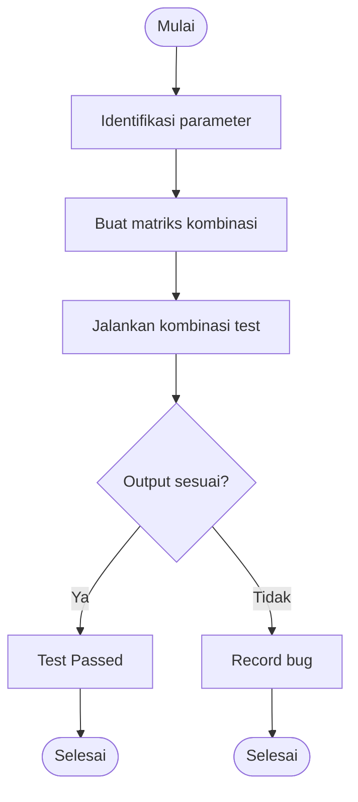

# 🧩 Matrix Testing

> **Model Gray Box Testing #2** — *Matrix Testing*  
> **Project:** Tempat.in — Restaurant Reservation Platform  
> **Metode:** Gray Box Testing

---

# 📖 1. Definisi

**Matrix Testing** adalah metode Gray Box Testing yang digunakan untuk menguji hubungan antar parameter dan kondisi dalam suatu sistem menggunakan matriks kombinasi.

Metode ini digunakan untuk:
- menguji kombinasi input,
- menguji relasi antar modul,
- memastikan setiap kondisi menghasilkan output yang sesuai.

Pada project **Tempat.in**, Matrix Testing digunakan untuk menguji:
- kombinasi role dan akses,
- kombinasi status reservasi,
- kombinasi payment dan reservation,
- kombinasi browser dan device,
- kombinasi autentikasi dan fitur.

---

# 🎯 2. Tujuan Pengujian

| No | Tujuan |
|---|---|
| 1 | Menguji relasi antar parameter |
| 2 | Menguji akses berdasarkan role |
| 3 | Menguji kombinasi state sistem |
| 4 | Menguji consistency business logic |
| 5 | Mengidentifikasi konflik kondisi |

---

# 💻 3. Modul yang Diuji

| Modul | Fokus Pengujian |
|---|---|
| Authentication | Role access |
| Reservation | Reservation state |
| Payment | Payment status |
| Admin Panel | Access permission |
| Responsive UI | Device compatibility |

---

# 🔷 4. Matrix Testing — Role Access

## Parameter

| Parameter | Value |
|---|---|
| Role | Guest, User, Admin |
| Feature | Reservation, Payment, Dashboard |

---

## Access Matrix

| Role | Reservation | Payment | Admin Dashboard |
|---|---|---|---|
| Guest | ❌ | ❌ | ❌ |
| User | ✅ | ✅ | ❌ |
| Admin | ✅ | ✅ | ✅ |

---

# 🔷 5. Matrix Testing — Reservation State

## Parameter

| Parameter | Value |
|---|---|
| Reservation Status | Draft, Pending, Confirmed, Expired |
| Payment Status | Unpaid, Paid, Failed |

---

## State Matrix

| Reservation Status | Payment Status | Expected Result |
|---|---|---|
| Draft | Unpaid | Waiting reservation |
| Pending | Unpaid | Waiting payment |
| Pending | Paid | Auto confirmed |
| Pending | Failed | Payment retry |
| Confirmed | Paid | Reservation active |
| Expired | Unpaid | Reservation closed |

---

# 🔷 6. Matrix Testing — Browser & Device

## Compatibility Matrix

| Browser | Desktop | Tablet | Mobile |
|---|---|---|---|
| Chrome | ✅ | ✅ | ✅ |
| Firefox | ✅ | ✅ | ✅ |
| Edge | ✅ | ✅ | ✅ |
| Safari | ✅ | ⚠️ | ⚠️ |

---

# 🧪 7. Test Case

## 7.1 Role Access Testing

| TC ID | Role | Feature | Expected Result |
|---|---|---|---|
| MTX-ROLE-01 | Guest | Reservation | Access denied |
| MTX-ROLE-02 | User | Reservation | Access granted |
| MTX-ROLE-03 | User | Admin dashboard | Forbidden |
| MTX-ROLE-04 | Admin | Admin dashboard | Access granted |

---

## 7.2 Reservation State Testing

| TC ID | Reservation | Payment | Expected Result |
|---|---|---|---|
| MTX-RES-01 | Pending | Paid | Confirmed |
| MTX-RES-02 | Pending | Failed | Retry payment |
| MTX-RES-03 | Expired | Unpaid | Reservation closed |
| MTX-RES-04 | Confirmed | Paid | Reservation active |

---

## 7.3 Browser Compatibility Testing

| TC ID | Browser | Device | Expected Result |
|---|---|---|---|
| MTX-BRW-01 | Chrome | Desktop | Stable |
| MTX-BRW-02 | Safari | Mobile | Minor issue |
| MTX-BRW-03 | Firefox | Tablet | Stable |

---

# 🔶 8. Activity Diagram

## 8.1 Matrix Validation Flow



---

# 🔵 9. Gherkin Scenario

```gherkin
Feature: Matrix Combination Testing

  Scenario: User mengakses reservation
    Given user login sebagai User
    When user membuka halaman reservation
    Then akses diberikan

  Scenario: Guest mengakses payment
    Given user belum login
    When user membuka halaman payment
    Then sistem menolak akses

  Scenario: Payment berhasil mengubah reservation
    Given reservation status pending
    And payment status paid
    When payment callback diterima
    Then reservation berubah menjadi confirmed

  Scenario: Safari mobile compatibility
    Given user menggunakan Safari mobile
    When user membuka halaman reservasi
    Then seluruh komponen tampil normal
```

---

# 📊 10. Hasil Eksekusi

| Test Case | Expected Result | Status |
|---|---|---|
| MTX-ROLE-01 | Access denied | ⏳ Pending |
| MTX-ROLE-04 | Access granted | ⏳ Pending |
| MTX-RES-01 | Confirmed | ⏳ Pending |
| MTX-BRW-02 | Minor issue | ⏳ Pending |

---

# 🐛 11. Prediksi Temuan Bug

| ID | Severity | Deskripsi |
|---|---|---|
| MTX-001 | High | Guest dapat mengakses reservation API |
| MTX-002 | Medium | Payment status tidak mengubah reservation |
| MTX-003 | Medium | Safari mobile mengalami layout shift |
| MTX-004 | Low | Redirect role tidak konsisten |

---

# ⚖️ 12. Kelebihan & Kekurangan

## ✅ Kelebihan
- Menguji relasi antar parameter
- Cocok untuk role & state testing
- Mengurangi kombinasi redundant
- Membantu validasi business logic

## ❌ Kekurangan
- Matrix besar sulit dikelola
- Membutuhkan perancangan detail
- Tidak menguji performa sistem

---

# 🛠️ 13. Tools Pendukung

| Tool | Fungsi |
|---|---|
| PHPUnit | Role testing |
| Postman | API validation |
| BrowserStack | Compatibility testing |
| Laravel Middleware | Access validation |

---

# 📚 Referensi

1. Suprihadi, D. (2025). Software Quality — Gray Box Testing.
2. Myers, G. J. The Art of Software Testing.
3. Laravel Authorization Documentation.
