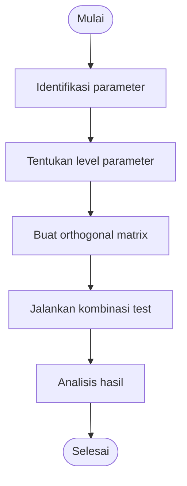

# 🎲 Orthogonal Array Testing (OAT)

> **Model Gray Box Testing #1** — *Orthogonal Array Testing*  
> **Project:** Tempat.in — Restaurant Reservation Platform  
> **Metode:** Gray Box Testing

---

# 📖 1. Definisi

**Orthogonal Array Testing (OAT)** adalah metode Gray Box Testing yang digunakan untuk menguji kombinasi berbagai parameter input menggunakan jumlah test case yang lebih sedikit namun tetap memiliki cakupan pengujian yang luas.

Metode ini sangat cocok digunakan pada sistem dengan:
- banyak kombinasi input,
- banyak parameter,
- validasi multi-field,
- business logic kompleks.

Pada project **Tempat.in**, OAT digunakan untuk menguji kombinasi:
- jenis restoran,
- jumlah tamu,
- metode pembayaran,
- waktu reservasi,
- device pengguna.

---

# 🎯 2. Tujuan Pengujian

| No | Tujuan |
|---|---|
| 1 | Menguji kombinasi parameter sistem |
| 2 | Mengurangi jumlah test case |
| 3 | Mengidentifikasi kombinasi input bermasalah |
| 4 | Menguji kompatibilitas flow reservasi |
| 5 | Mengoptimalkan cakupan pengujian |

---

# 💻 3. Modul yang Diuji

| Modul | Fokus Pengujian |
|---|---|
| Reservation | Kombinasi data reservasi |
| Payment | Kombinasi metode pembayaran |
| Restaurant Search | Kombinasi filter |
| Device Compatibility | Browser & device |
| Reservation Availability | Slot & waktu reservasi |

---

# 🔷 4. Parameter Pengujian

## 4.1 Faktor dan Level

| Faktor | Level 1 | Level 2 | Level 3 |
|---|---|---|---|
| Jenis Restoran | Cafe | Sushi | Steakhouse |
| Jumlah Tamu | 2 Orang | 6 Orang | 12 Orang |
| Payment Method | QRIS | E-Wallet | Bank Transfer |
| Device | Desktop | Tablet | Mobile |

---

# 🔷 5. Orthogonal Array Matrix

## OAT L9 (3⁴)

| Test Case | Restaurant | Guest | Payment | Device |
|---|---|---|---|---|
| OAT-01 | Cafe | 2 | QRIS | Desktop |
| OAT-02 | Cafe | 6 | E-Wallet | Tablet |
| OAT-03 | Cafe | 12 | Bank Transfer | Mobile |
| OAT-04 | Sushi | 2 | E-Wallet | Mobile |
| OAT-05 | Sushi | 6 | Bank Transfer | Desktop |
| OAT-06 | Sushi | 12 | QRIS | Tablet |
| OAT-07 | Steakhouse | 2 | Bank Transfer | Tablet |
| OAT-08 | Steakhouse | 6 | QRIS | Mobile |
| OAT-09 | Steakhouse | 12 | E-Wallet | Desktop |

---

# 🧪 6. Test Case

## 6.1 Reservation Combination Testing

| TC ID | Kombinasi | Expected Result |
|---|---|---|
| OAT-01 | Cafe + 2 guest + QRIS + Desktop | Reservasi berhasil |
| OAT-02 | Cafe + 6 guest + E-Wallet + Tablet | Reservasi berhasil |
| OAT-03 | Cafe + 12 guest + Transfer + Mobile | Reservasi berhasil |
| OAT-04 | Sushi + 2 guest + E-Wallet + Mobile | Reservasi berhasil |
| OAT-05 | Sushi + 6 guest + Transfer + Desktop | Reservasi berhasil |
| OAT-06 | Sushi + 12 guest + QRIS + Tablet | Reservasi berhasil |
| OAT-07 | Steakhouse + 2 guest + Transfer + Tablet | Reservasi berhasil |
| OAT-08 | Steakhouse + 6 guest + QRIS + Mobile | Reservasi berhasil |
| OAT-09 | Steakhouse + 12 guest + E-Wallet + Desktop | Reservasi berhasil |

---

# 🔶 7. Activity Diagram

## 7.1 Orthogonal Testing Flow



---

# 🔵 8. Gherkin Scenario

```gherkin
Feature: Reservation Combination Testing

  Scenario: Reservasi menggunakan QRIS di desktop
    Given user memilih restoran Cafe
    And jumlah tamu 2 orang
    And metode pembayaran QRIS
    When user melakukan reservasi melalui desktop
    Then reservasi berhasil dibuat

  Scenario: Reservasi menggunakan E-Wallet di mobile
    Given user memilih restoran Sushi
    And jumlah tamu 6 orang
    And metode pembayaran E-Wallet
    When user melakukan reservasi melalui mobile
    Then reservasi berhasil dibuat

  Scenario: Reservasi menggunakan transfer bank di tablet
    Given user memilih restoran Steakhouse
    And jumlah tamu 12 orang
    And metode pembayaran bank transfer
    When user melakukan reservasi melalui tablet
    Then reservasi berhasil diproses
```

---

# 📊 9. Hasil Eksekusi

| Test Case | Expected Result | Status |
|---|---|---|
| OAT-01 | Reservasi berhasil | ⏳ Pending |
| OAT-03 | Payment success | ⏳ Pending |
| OAT-05 | Reservasi berhasil | ⏳ Pending |
| OAT-08 | Mobile reservation stable | ⏳ Pending |
| OAT-09 | Desktop reservation stable | ⏳ Pending |

---

# 🐛 10. Prediksi Temuan Bug

| ID | Severity | Deskripsi |
|---|---|---|
| OAT-001 | Medium | Payment QRIS gagal pada mobile |
| OAT-002 | Medium | Layout tablet tidak stabil |
| OAT-003 | High | Duplicate reservation pada kombinasi tertentu |
| OAT-004 | Low | Payment redirect tidak konsisten |

---

# ⚖️ 11. Kelebihan & Kekurangan

## ✅ Kelebihan
- Mengurangi jumlah test case
- Efisien untuk kombinasi parameter besar
- Coverage tinggi
- Cocok untuk integration testing

## ❌ Kekurangan
- Tidak menguji seluruh kombinasi penuh
- Membutuhkan perancangan matrix
- Sulit jika parameter terlalu kompleks

---

# 🛠️ 12. Tools Pendukung

| Tool | Fungsi |
|---|---|
| PHPUnit | Functional testing |
| Postman | API testing |
| BrowserStack | Device testing |
| Laravel Dusk | Browser automation |

---

# 📚 Referensi

1. Suprihadi, D. (2025). Software Quality — Gray Box Testing.
2. Myers, G. J. The Art of Software Testing.
3. Orthogonal Array Testing Documentation.
