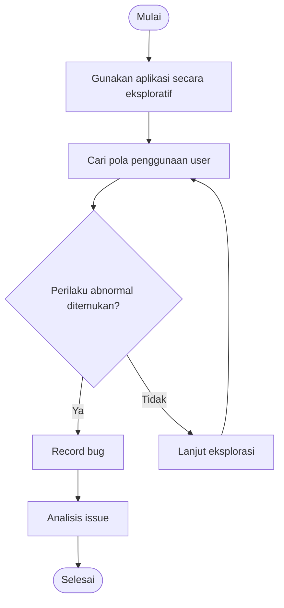

# 🧭 Pattern Testing

> **Model Gray Box Testing #4** — *Pattern Testing / Exploratory Testing*  
> **Project:** Tempat.in — Restaurant Reservation Platform  
> **Metode:** Gray Box Testing

---

# 📖 1. Definisi

**Pattern Testing** adalah metode Gray Box Testing yang berfokus pada eksplorasi pola perilaku sistem untuk menemukan bug yang tidak terdeteksi oleh pengujian formal.

Metode ini juga dikenal sebagai:
- Exploratory Testing
- Discovery Testing

Pattern Testing dilakukan berdasarkan:
- intuisi tester,
- pola penggunaan user,
- pengalaman penggunaan sistem,
- kombinasi skenario tidak terduga.

Pada project **Tempat.in**, Pattern Testing digunakan untuk:
- menguji pola penggunaan reservasi,
- menguji perilaku user tidak normal,
- menguji flow payment,
- menguji navigasi sistem,
- menguji kestabilan UI/UX.

---

# 🎯 2. Tujuan Pengujian

| No | Tujuan |
|---|---|
| 1 | Menemukan bug tersembunyi |
| 2 | Menguji perilaku user tidak terduga |
| 3 | Menguji usability aplikasi |
| 4 | Menguji flow navigasi |
| 5 | Menguji stabilitas sistem saat digunakan secara real-world |

---

# 💻 3. Modul yang Diuji

| Modul | Fokus Pengujian |
|---|---|
| Authentication | Login & logout pattern |
| Reservation | Reservation behavior |
| Payment | User payment flow |
| Search | Search interaction |
| UI/UX | Navigation pattern |

---

# 🔷 4. Skenario Pattern Testing

## 4.1 Authentication Pattern

### Skenario
- Login → Logout → Login cepat
- Login multi-tab
- Refresh saat login
- Back button setelah logout

### Tujuan
Mengidentifikasi bug session dan autentikasi.

---

## 4.2 Reservation Pattern

### Skenario
- Reservasi berulang cepat
- Submit button spam
- Refresh saat reservation pending
- Back navigation saat payment

### Tujuan
Mengidentifikasi duplicate reservation dan inconsistent state.

---

## 4.3 Payment Pattern

### Skenario
- Menutup payment popup
- Refresh halaman payment
- Payment callback terlambat
- Double payment click

### Tujuan
Menguji kestabilan payment flow.

---

## 4.4 Search Pattern

### Skenario
- Search keyword cepat berulang
- Search menggunakan emoji
- Search menggunakan simbol
- Search panjang ekstrem

### Tujuan
Menguji stabilitas pencarian restoran.

---

# 🧪 5. Test Case

## 5.1 Authentication Pattern Testing

| TC ID | Skenario | Expected Result |
|---|---|---|
| PAT-AUTH-01 | Login → Logout → Login | Session normal |
| PAT-AUTH-02 | Multi-tab login | Session sinkron |
| PAT-AUTH-03 | Back setelah logout | Redirect login |

---

## 5.2 Reservation Pattern Testing

| TC ID | Skenario | Expected Result |
|---|---|---|
| PAT-RES-01 | Spam submit reservasi | Tidak duplicate |
| PAT-RES-02 | Refresh pending payment | Status tetap |
| PAT-RES-03 | Back button payment | State tetap konsisten |

---

## 5.3 Payment Pattern Testing

| TC ID | Skenario | Expected Result |
|---|---|---|
| PAT-PAY-01 | Tutup popup payment | Payment pending |
| PAT-PAY-02 | Double click payment | Single transaction |
| PAT-PAY-03 | Callback delay | Status tetap sinkron |

---

## 5.4 Search Pattern Testing

| TC ID | Skenario | Expected Result |
|---|---|---|
| PAT-SRC-01 | Search cepat berulang | Stable |
| PAT-SRC-02 | Search emoji | No crash |
| PAT-SRC-03 | Search simbol random | Empty result |

---

# 🔶 6. Exploratory Pattern Matrix

| Pattern | Risiko | Severity |
|---|---|---|
| Spam Click | Duplicate transaction | High |
| Refresh Page | State inconsistency | Medium |
| Multi-tab Login | Session conflict | Medium |
| Back Navigation | Unauthorized access | Medium |
| Long Search Input | UI freeze | Low |

---

# 🔶 7. Activity Diagram

## 7.1 Exploratory Testing Flow



---

# 🔵 8. Gherkin Scenario

```gherkin
Feature: Exploratory Pattern Testing

  Scenario: Spam click reservasi
    Given user membuka form reservasi
    When user menekan tombol submit berkali-kali
    Then sistem hanya membuat satu reservasi

  Scenario: Refresh saat payment pending
    Given user berada di halaman payment
    When halaman di-refresh
    Then status payment tetap sinkron

  Scenario: Multi-tab login
    Given user login di dua tab browser
    When user logout pada salah satu tab
    Then session tab lain ikut terlogout

  Scenario: Search menggunakan emoji
    When user mencari restoran menggunakan emoji
    Then sistem tidak crash
```

---

# 📊 9. Hasil Eksekusi

| Test Case | Expected Result | Status |
|---|---|---|
| PAT-AUTH-03 | Redirect login | ⏳ Pending |
| PAT-RES-01 | Tidak duplicate | ⏳ Pending |
| PAT-PAY-02 | Single transaction | ⏳ Pending |
| PAT-SRC-02 | No crash | ⏳ Pending |

---

# 🐛 10. Prediksi Temuan Bug

| ID | Severity | Deskripsi |
|---|---|---|
| PAT-001 | High | Spam click membuat duplicate reservation |
| PAT-002 | High | Double payment membuat transaksi ganda |
| PAT-003 | Medium | Refresh payment menyebabkan state mismatch |
| PAT-004 | Medium | Back button bypass authentication |
| PAT-005 | Low | Search emoji merusak layout UI |

---

# ⚖️ 11. Kelebihan & Kekurangan

## ✅ Kelebihan
- Menemukan bug tersembunyi
- Menguji perilaku real-world
- Fleksibel dan kreatif
- Cocok untuk UX testing

## ❌ Kekurangan
- Sulit didokumentasikan
- Bergantung pada pengalaman tester
- Coverage tidak selalu konsisten

---

# 🛠️ 12. Tools Pendukung

| Tool | Fungsi |
|---|---|
| Laravel Dusk | Browser interaction testing |
| Browser DevTools | Exploratory debugging |
| Postman | API exploratory testing |
| OWASP ZAP | Exploratory security testing |

---

# 📚 Referensi

1. Suprihadi, D. (2025). Software Quality — Gray Box Testing.
2. Myers, G. J. The Art of Software Testing.
3. OWASP Testing Guide.
4. Exploratory Testing Documentation.
