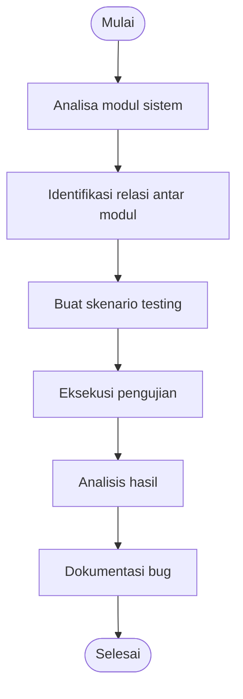

# 🎲 Gray Box Testing Documentation  
## Project: Tempat.in — Restaurant Reservation Platform

---

# 📖 Deskripsi

Dokumentasi ini berisi seluruh proses **Gray Box Testing** pada project **Tempat.in**, yaitu platform reservasi restoran berbasis web.

Gray Box Testing merupakan metode pengujian yang menggabungkan:
- perspektif pengguna (*Black Box*),
- dan pemahaman sebagian terhadap struktur internal sistem (*White Box*).

Pendekatan ini memungkinkan pengujian:
- business logic,
- relasi antar modul,
- state system,
- integration flow,
- dan kombinasi parameter sistem.

---

# 🎯 Tujuan Pengujian

Tujuan utama Gray Box Testing pada project ini adalah:

- Menguji hubungan antar modul sistem.
- Menguji kombinasi parameter dan state aplikasi.
- Memastikan perubahan sistem tidak merusak fitur lama.
- Mengidentifikasi bug tersembunyi pada integration flow.
- Menguji pola perilaku user terhadap sistem.

---

# 🧩 Metode Gray Box Testing yang Digunakan

| No | Metode | File Dokumentasi |
|---|---|---|
| 1 | Orthogonal Array Testing | `Orthogonal-Array-Testing.md` |
| 2 | Matrix Testing | `Matrix-Testing.md` |
| 3 | Regression Testing | `Regression-Testing.md` |
| 4 | Pattern Testing | `Pattern-Testing.md` |

---

# 💻 Modul Sistem yang Diuji

| Modul | Deskripsi |
|---|---|
| Authentication | Login, Register, Session |
| Reservation | Reservasi restoran |
| Payment | Pembayaran reservasi |
| Restaurant Listing | Data restoran |
| Search System | Pencarian restoran |
| Admin Dashboard | Role & access control |
| Reservation State | Status reservasi |
| Session Management | Session persistence |

---

# 🔍 Ruang Lingkup Pengujian

## Integration Testing
- Authentication ↔ Reservation
- Reservation ↔ Payment
- Payment ↔ Reservation Status

## Business Logic Testing
- Reservation state transition
- Role access validation
- Payment callback logic

## Combination Testing
- Browser & device matrix
- Parameter combination
- User behavior pattern

## Stability Testing
- Regression stability
- Session synchronization
- State consistency

---

# 🛠️ Tools Pengujian

| Tool | Fungsi |
|---|---|
| PHPUnit | Functional & integration testing |
| Laravel Dusk | Browser automation |
| Postman | API testing |
| BrowserStack | Cross-browser testing |
| OWASP ZAP | Security testing |
| Selenium | Automation testing |

---

# 📂 Struktur Dokumentasi

```text
GrayBox-Testing/
│
├── README.md
├── Orthogonal-Array-Testing.md
├── Matrix-Testing.md
├── Regression-Testing.md
└── Pattern-Testing.md
```

---

# 🔄 Alur Pengujian



---

# 📊 Fokus Pengujian

| Fokus | Metode |
|---|---|
| Kombinasi Parameter | Orthogonal Array Testing |
| Relasi Antar Kondisi | Matrix Testing |
| Stabilitas Setelah Update | Regression Testing |
| Pola Penggunaan User | Pattern Testing |

---

# 🐛 Jenis Bug yang Ditargetkan

- Integration Bug
- Session Bug
- State Transition Bug
- Role Access Bug
- Duplicate Reservation
- Payment Callback Error
- Browser Compatibility Issue
- Regression Bug
- Pattern-based Exploit

---

# ⚖️ Kelebihan Gray Box Testing

## ✅ Kelebihan
- Menguji business logic lebih dalam.
- Cocok untuk integration testing.
- Efektif menemukan hidden bug.
- Menguji relasi antar modul.
- Lebih efisien dibanding White Box penuh.

## ❌ Kekurangan
- Membutuhkan pemahaman arsitektur sistem.
- Dokumentasi lebih kompleks.
- Sulit dilakukan tanpa knowledge sistem.

---

# 📚 Referensi

1. Suprihadi, D. (2025). *Software Quality — Gray Box Testing*.
2. Myers, G. J. *The Art of Software Testing*.
3. OWASP Testing Guide.
4. Laravel Documentation.
5. Selenium Documentation.

---

# 👨‍💻 Project Information

| Item | Detail |
|---|---|
| Project | Tempat.in |
| Type | Restaurant Reservation Platform |
| Framework | Laravel |
| Database | MySQL |
| Testing Method | Gray Box Testing |
| Documentation Format | Markdown (.md) |

---

# 🚀 Kesimpulan

Gray Box Testing pada project **Tempat.in** dilakukan untuk memastikan:
- integrasi antar modul berjalan normal,
- business logic tetap konsisten,
- perubahan sistem tidak merusak fitur lama,
- serta aplikasi mampu menangani berbagai pola penggunaan user.

Pendekatan ini memberikan keseimbangan antara:
- pengujian perilaku eksternal,
- dan pemahaman struktur internal sistem.
