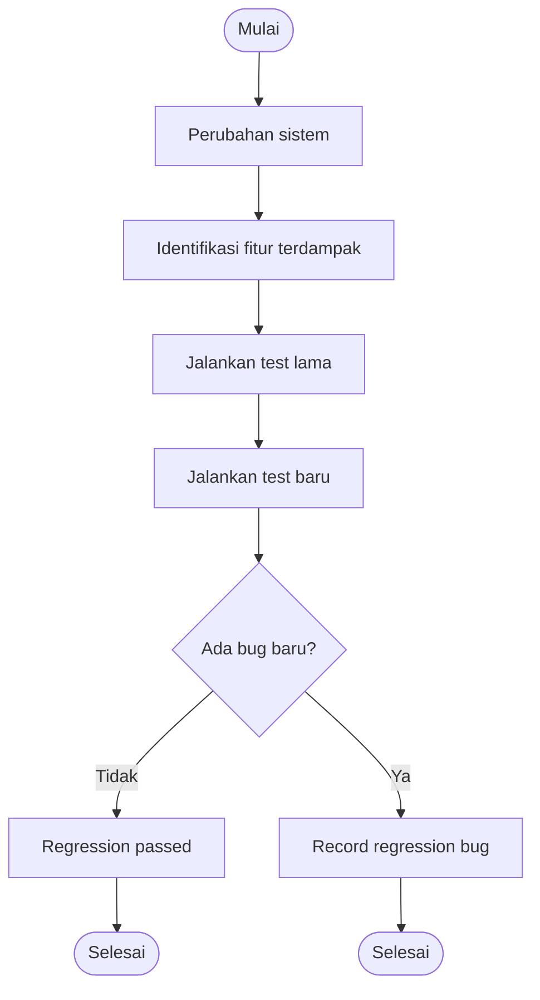

# 🔁 Regression Testing

> **Model Gray Box Testing #3** — *Regression Testing*  
> **Project:** Tempat.in — Restaurant Reservation Platform  
> **Metode:** Gray Box Testing

---

# 📖 1. Definisi

**Regression Testing** adalah metode Gray Box Testing yang digunakan untuk memastikan bahwa perubahan pada sistem tidak menyebabkan kerusakan pada fitur yang sebelumnya sudah berjalan dengan baik.

Metode ini dilakukan setelah:
- penambahan fitur baru,
- perbaikan bug,
- perubahan database,
- perubahan API,
- perubahan infrastruktur.

Pada project **Tempat.in**, Regression Testing digunakan untuk memastikan:
- flow reservasi tetap berjalan,
- payment tetap stabil,
- autentikasi tidak rusak,
- fitur lama tetap kompatibel setelah update.

---

# 🎯 2. Tujuan Pengujian

| No | Tujuan |
|---|---|
| 1 | Memastikan fitur lama tetap berjalan |
| 2 | Menguji dampak perubahan sistem |
| 3 | Mengurangi risiko bug baru |
| 4 | Menjaga stabilitas aplikasi |
| 5 | Menguji kompatibilitas setelah update |

---

# 💻 3. Modul yang Diuji

| Modul | Fokus Pengujian |
|---|---|
| Authentication | Login & session |
| Reservation | Flow reservasi |
| Payment | Payment callback |
| Restaurant Listing | Data loading |
| Admin Dashboard | CRUD management |

---

# 🔷 4. Skenario Regression Testing

## 4.1 Penambahan Fitur Baru

### Perubahan
```text
Penambahan fitur reschedule reservation
```

### Fokus Pengujian
- Reservation lama tetap berjalan
- Payment tidak terganggu
- History reservasi tetap muncul

---

## 4.2 Perbaikan Bug

### Perubahan
```text
Perbaikan duplicate reservation bug
```

### Fokus Pengujian
- Duplicate booking tidak terjadi
- Reservation normal tetap berhasil
- Payment callback tetap berjalan

---

## 4.3 Perubahan Infrastruktur

### Perubahan
```text
Migrasi database server
```

### Fokus Pengujian
- API tetap stabil
- Session tetap aktif
- Query tetap normal

---

# 🧪 5. Test Case

## 5.1 Authentication Regression

| TC ID | Skenario | Expected Result |
|---|---|---|
| REG-AUTH-01 | Login setelah update | Login berhasil |
| REG-AUTH-02 | Logout session | Session terhapus |
| REG-AUTH-03 | Register user baru | Register berhasil |

---

## 5.2 Reservation Regression

| TC ID | Skenario | Expected Result |
|---|---|---|
| REG-RES-01 | Reservasi normal | Reservasi berhasil |
| REG-RES-02 | Reschedule reservation | Jadwal berubah |
| REG-RES-03 | Duplicate reservation | Ditolak sistem |

---

## 5.3 Payment Regression

| TC ID | Skenario | Expected Result |
|---|---|---|
| REG-PAY-01 | Payment QRIS | Success |
| REG-PAY-02 | Payment callback | Status confirmed |
| REG-PAY-03 | Payment expired | Reservation expired |

---

## 5.4 Infrastructure Regression

| TC ID | Skenario | Expected Result |
|---|---|---|
| REG-INF-01 | Database query | Stable |
| REG-INF-02 | API request | Stable |
| REG-INF-03 | Session persistence | Stable |

---

# 🔶 6. Regression Matrix

| Feature | Sebelum Update | Sesudah Update | Status |
|---|---|---|---|
| Login | Normal | Normal | ✅ |
| Reservation | Normal | Normal | ✅ |
| Payment | Normal | Normal | ✅ |
| Reschedule | Tidak ada | Added | ✅ |
| Session | Stable | Stable | ✅ |

---

# 🔶 7. Activity Diagram

## 7.1 Regression Flow



---

# 🔵 8. Gherkin Scenario

```gherkin
Feature: Regression Stability

  Scenario: Login tetap berjalan setelah update
    Given sistem telah diperbarui
    When user melakukan login
    Then login tetap berhasil

  Scenario: Reservation tetap normal setelah fitur baru
    Given fitur reschedule telah ditambahkan
    When user membuat reservasi
    Then reservasi tetap berhasil

  Scenario: Duplicate reservation ditolak
    Given user sudah memiliki reservasi pada slot tertentu
    When user mencoba reservasi ulang pada slot sama
    Then sistem menolak reservasi

  Scenario: Payment callback tetap berjalan
    Given sistem menggunakan server baru
    When payment callback diterima
    Then reservation berubah menjadi confirmed
```

---

# 📊 9. Hasil Eksekusi

| Test Case | Expected Result | Status |
|---|---|---|
| REG-AUTH-01 | Login berhasil | ⏳ Pending |
| REG-RES-02 | Reschedule success | ⏳ Pending |
| REG-RES-03 | Duplicate rejected | ⏳ Pending |
| REG-PAY-02 | Callback success | ⏳ Pending |
| REG-INF-01 | Database stable | ⏳ Pending |

---

# 🐛 10. Prediksi Temuan Bug

| ID | Severity | Deskripsi |
|---|---|---|
| REG-001 | High | Fitur baru merusak reservation lama |
| REG-002 | High | Payment callback gagal setelah update |
| REG-003 | Medium | Session logout otomatis |
| REG-004 | Medium | Duplicate reservation masih terjadi |
| REG-005 | Low | Redirect flow berubah setelah update |

---

# ⚖️ 11. Kelebihan & Kekurangan

## ✅ Kelebihan
- Menjaga stabilitas aplikasi
- Mengurangi risiko bug baru
- Cocok untuk CI/CD workflow
- Memastikan backward compatibility

## ❌ Kekurangan
- Membutuhkan banyak test case lama
- Waktu testing lebih panjang
- Sulit jika dokumentasi test tidak lengkap

---

# 🛠️ 12. Tools Pendukung

| Tool | Fungsi |
|---|---|
| PHPUnit | Regression testing |
| Laravel Dusk | Browser regression |
| Postman Collection | API regression |
| GitHub Actions | CI/CD automation |
| Selenium | Automated regression |

---

# 📚 Referensi

1. Suprihadi, D. (2025). Software Quality — Gray Box Testing.
2. Myers, G. J. The Art of Software Testing.
3. Laravel Testing Documentation.
4. Selenium Documentation.
