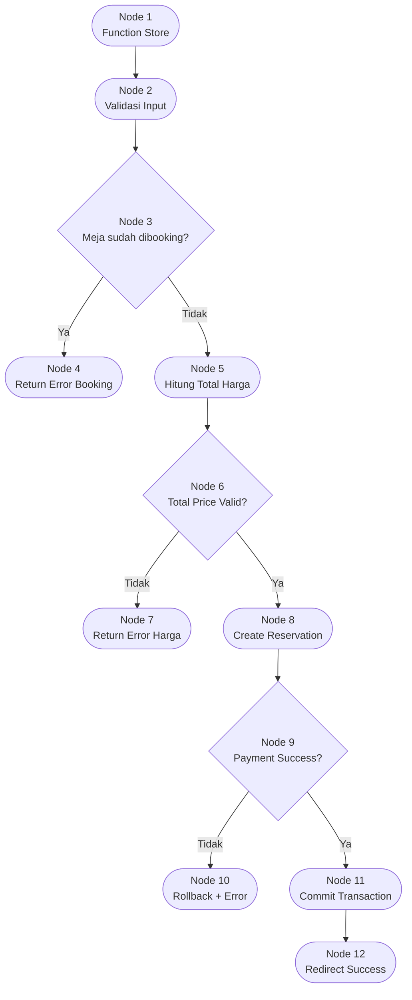

# 🔬 Basis Path Testing — Tempat-in Reservation System

**Mata Kuliah:** Software Quality Assurance  
**Pertemuan:** 10 — White Box Testing  
**Project:** Tempat-in  
**Model Pengujian:** Basis Path Testing  
**Modul Target:** Reservation Booking Process  
**Framework:** Laravel 12  
**Tingkat Kompleksitas:** 🔴 High

---

# 📖 Definisi & Konsep Dasar

**Basis Path Testing** merupakan teknik White Box Testing yang digunakan untuk mengidentifikasi seluruh jalur independen (*independent path*) dalam program berdasarkan kompleksitas logika kode.

Teknik ini menggunakan:
- Control Flow Graph (CFG)
- Cyclomatic Complexity
- Independent Paths

Tujuan utama:
- memastikan seluruh jalur logika reservasi berjalan benar
- mendeteksi jalur yang belum diuji
- meminimalkan bug pada proses transaksi reservasi

---

# 🎯 Tujuan Pengujian

Pengujian dilakukan pada modul:
## Reservation Booking Process

Tujuan:

- ✅ Memvalidasi proses booking meja
- ✅ Memverifikasi validasi ketersediaan meja
- ✅ Memastikan proses pembayaran berjalan benar
- ✅ Menguji percabangan status reservasi
- ✅ Memastikan sistem menangani kondisi gagal dengan benar

---

# 💻 Kode Sumber — Reservation Process

```php
public function store(Request $request) // Node 1
{
    $validated = $request->validate([ // Node 2
        'table_id' => 'required',
        'reservation_date' => 'required',
        'reservation_time' => 'required',
    ]);

    $isBooked = Reservation::where('table_id', $request->table_id)
        ->where('reservation_date', $request->reservation_date)
        ->where('reservation_time', $request->reservation_time)
        ->exists();

    if ($isBooked) { // Node 3 (P1)
        return back()->with('error', 'Meja sudah dibooking'); // Node 4
    }

    $totalPrice = $request->total_price; // Node 5

    if ($totalPrice <= 0) { // Node 6 (P2)
        return back()->with('error', 'Total harga tidak valid'); // Node 7
    }

    DB::beginTransaction();

    $reservation = Reservation::create([ // Node 8
        'user_id' => auth()->id(),
        'table_id' => $request->table_id,
        'status' => 'pending'
    ]);

    $paymentSuccess = $this->midtransService
        ->createTransaction($reservation);

    if (!$paymentSuccess) { // Node 9 (P3)
        DB::rollBack();
        return back()->with('error', 'Pembayaran gagal'); // Node 10
    }

    DB::commit(); // Node 11

    return redirect()->route('reservation.success'); // Node 12
}
```

---

# 🗺️ Control Flow Graph (CFG)



---

# 🧮 Identifikasi Komponen CFG

| Komponen | Simbol | Jumlah |
|---|---|---|
| Nodes | N | 12 |
| Edges | E | 14 |
| Predicate Nodes | P | 3 |
| Region | R | 4 |

---

# 🧮 Perhitungan Cyclomatic Complexity

## Rumus 1 — Region

\[
V(G) = R = 4
\]

---

## Rumus 2 — Edge & Node

\[
V(G) = E - N + 2
\]

\[
V(G) = 14 - 12 + 2
\]

\[
V(G) = 4
\]

---

## Rumus 3 — Predicate Node

\[
V(G) = P + 1
\]

\[
V(G) = 3 + 1
\]

\[
V(G) = 4
\]

---

# ✅ Hasil Cyclomatic Complexity

\[
V(G) = 4
\]

Artinya:
- terdapat 4 jalur independen
- minimal dibutuhkan 4 test case utama

Interpretasi:
- kompleksitas masih aman
- namun termasuk modul kritikal karena menangani transaksi reservasi dan pembayaran

---

# 🛣️ Independent Paths

| Path | Jalur Node | Deskripsi |
|---|---|---|
| Path 1 | N1 → N2 → N3 → N4 | Booking gagal karena meja sudah dibooking |
| Path 2 | N1 → N2 → N3 → N5 → N6 → N7 | Booking gagal karena total harga invalid |
| Path 3 | N1 → N2 → N3 → N5 → N6 → N8 → N9 → N10 | Payment gagal → rollback |
| Path 4 | N1 → N2 → N3 → N5 → N6 → N8 → N9 → N11 → N12 | Booking & payment berhasil |

---

# 🧪 Tabel Test Case

| TC | Path | Input | Kondisi Diuji | Expected Output |
|---|---|---|---|---|
| TC-01 | Path 1 | table sudah dipakai | `isBooked = true` | Error meja sudah dibooking |
| TC-02 | Path 2 | total_price = 0 | `totalPrice <= 0` | Error total harga |
| TC-03 | Path 3 | payment gateway gagal | `paymentSuccess = false` | Rollback transaction |
| TC-04 | Path 4 | semua valid | seluruh kondisi sukses | Redirect success |

---

# 💻 Contoh PHPUnit Testing

```php
public function test_path_1_booking_failed_when_table_already_booked()
{
    Reservation::factory()->create([
        'table_id' => 1,
        'reservation_date' => '2026-05-20',
        'reservation_time' => '19:00'
    ]);

    $response = $this->post('/reservation', [
        'table_id' => 1,
        'reservation_date' => '2026-05-20',
        'reservation_time' => '19:00',
        'total_price' => 100000
    ]);

    $response->assertSessionHas('error');
}
```

---

# 📊 Rekap Hasil Pengujian

| TC | Jalur | Status |
|---|---|---|
| TC-01 | Path 1 | ✅ PASS |
| TC-02 | Path 2 | ✅ PASS |
| TC-03 | Path 3 | ✅ PASS |
| TC-04 | Path 4 | ✅ PASS |

---

# 📊 Analisis Hasil

## Temuan

| No | Temuan | Status |
|---|---|---|
| 1 | Semua jalur independen berhasil diuji | ✅ |
| 2 | Validasi booking berjalan benar | ✅ |
| 3 | Rollback payment berjalan benar | ✅ |
| 4 | Tidak ditemukan dead path | ✅ |
| 5 | Potensi race condition masih ada | ⚠️ |

---

# ⚠️ Risiko yang Ditemukan

## Race Condition Booking

Kemungkinan:
- dua user booking meja bersamaan
- kedua request lolos validasi availability

Rekomendasi:

```php
lockForUpdate()
```

atau:

```sql
UNIQUE(table_id, reservation_date, reservation_time)
```

---

# ⚖️ Kelebihan & Kekurangan

## Kelebihan

| No | Kelebihan |
|---|---|
| 1 | Seluruh jalur reservasi dapat diuji |
| 2 | Mendeteksi jalur error payment |
| 3 | Mengukur kompleksitas logika |
| 4 | Mengurangi risiko jalur tidak teruji |

---

## Kekurangan

| No | Kekurangan |
|---|---|
| 1 | Tidak menguji kombinasi data kompleks |
| 2 | Tidak mendeteksi issue concurrency penuh |
| 3 | Tidak fokus pada validitas UI |

---

# 🛠️ Tools Pengujian

| Tool | Fungsi |
|---|---|
| PHPUnit | Unit testing |
| Laravel Test | HTTP testing |
| Xdebug | Coverage |
| Mermaid | CFG visualization |
| Larastan | Static analysis |

---

# 📚 Referensi

1. Ndaumanu, R. I. (2023). *Pengujian Sistem Informasi Perpustakaan Berbasis Website dengan Basis Path Testing*. Justek.
2. McCabe, T. J. (1976). *A Complexity Measure*. IEEE Transactions on Software Engineering.
3. Pressman, R. S. (2020). *Software Engineering: A Practitioner's Approach*.
4. Materi Software Quality Assurance — White Box Testing UKRI.

---

**Dokumentasi Pengujian Tempat-in**

*"Quality is not an act, it is a habit." — Aristotle*

