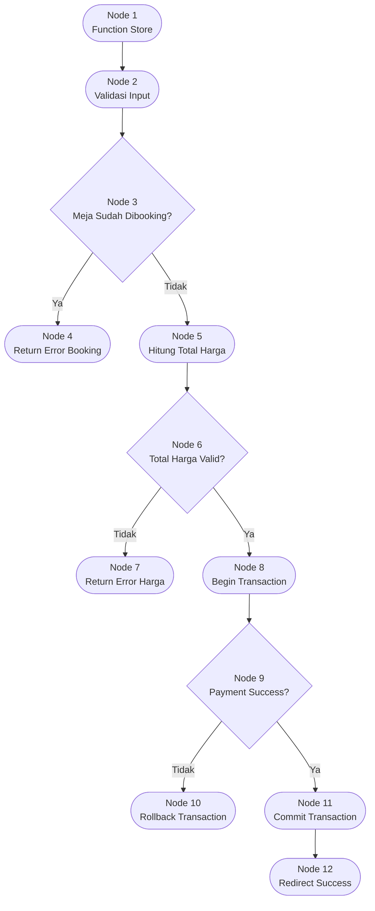

# 🔬 Control Flow Testing — Tempat-in Reservation System

**Mata Kuliah:** Software Quality Assurance  
**Pertemuan:** 10 — White Box Testing  
**Project:** Tempat-in  
**Model Pengujian:** Control Flow Testing  
**Modul Target:** Reservation Booking Process  
**Framework:** Laravel 12  
**Tingkat Kompleksitas:** 🔴 High

---

# 📖 Definisi & Konsep Dasar

**Control Flow Testing** merupakan teknik White Box Testing yang berfokus pada pengujian alur kontrol (*control logic*) dalam program untuk memastikan seluruh jalur eksekusi berjalan sesuai logika yang dirancang.

Teknik ini digunakan untuk:
- memeriksa percabangan logika
- memvalidasi proses decision making
- memastikan tidak terdapat dead path
- mendeteksi logical trap
- memastikan seluruh kondisi menghasilkan output yang benar

Pada sistem reservasi Tempat-in, Control Flow Testing sangat penting karena aplikasi memiliki banyak percabangan proses seperti:
- validasi booking
- pengecekan ketersediaan meja
- status pembayaran
- rollback transaksi
- redirect sukses/gagal

---

# 🎯 Tujuan Pengujian

Pengujian dilakukan pada:
## Reservation Booking Flow

Tujuan utama:

- ✅ Memastikan alur booking berjalan sesuai logika
- ✅ Memvalidasi seluruh percabangan kondisi
- ✅ Memastikan redirect error berjalan benar
- ✅ Memastikan transaksi database berjalan sesuai kondisi
- ✅ Memastikan payment flow tidak menghasilkan jalur tidak valid

---

# 💻 Kode Sumber — Reservation Flow

```php
public function store(Request $request) // Node 1
{
    $validated = $request->validate([ // Node 2
        'table_id' => 'required',
        'reservation_date' => 'required',
        'reservation_time' => 'required',
    ]);

    $isBooked = Reservation::where('table_id', $request->table_id)
        ->where('reservation_date', $request->reservation_date)
        ->where('reservation_time', $request->reservation_time)
        ->exists();

    if ($isBooked) { // Node 3
        return back()->with('error', 'Meja sudah dibooking'); // Node 4
    }

    $totalPrice = $request->total_price; // Node 5

    if ($totalPrice <= 0) { // Node 6
        return back()->with('error', 'Total harga tidak valid'); // Node 7
    }

    DB::beginTransaction(); // Node 8

    $reservation = Reservation::create([
        'user_id' => auth()->id(),
        'table_id' => $request->table_id,
        'status' => 'pending'
    ]);

    $paymentSuccess = $this->midtransService
        ->createTransaction($reservation);

    if (!$paymentSuccess) { // Node 9
        DB::rollBack();
        return back()->with('error', 'Pembayaran gagal'); // Node 10
    }

    DB::commit(); // Node 11

    return redirect()->route('reservation.success'); // Node 12
}
```

---

# 🗺️ Control Flow Graph (CFG)



---

# 🔀 Analisis Alur Kontrol

## Percabangan Kontrol

| Node | Jenis Kontrol | Kondisi |
|---|---|---|
| N3 | Decision | meja sudah dibooking |
| N6 | Decision | total harga valid |
| N9 | Decision | payment berhasil |

---

# 🛣️ Jalur Eksekusi Control Flow

| Flow | Jalur | Deskripsi |
|---|---|---|
| Flow 1 | N1 → N2 → N3 → N4 | Booking ditolak karena meja sudah dipakai |
| Flow 2 | N1 → N2 → N3 → N5 → N6 → N7 | Booking gagal karena total harga invalid |
| Flow 3 | N1 → N2 → N3 → N5 → N6 → N8 → N9 → N10 | Payment gagal dan transaction rollback |
| Flow 4 | N1 → N2 → N3 → N5 → N6 → N8 → N9 → N11 → N12 | Booking berhasil |

---

# 🧪 Tabel Test Case

| TC | Flow | Input | Kondisi | Expected Result |
|---|---|---|---|---|
| TC-01 | Flow 1 | meja sudah dibooking | `isBooked = true` | Redirect error booking |
| TC-02 | Flow 2 | total_price = 0 | `totalPrice <= 0` | Error total harga |
| TC-03 | Flow 3 | payment gagal | `paymentSuccess = false` | Rollback transaction |
| TC-04 | Flow 4 | seluruh data valid | seluruh kondisi lolos | Redirect success |

---

# 💻 Contoh Implementasi PHPUnit

```php
public function test_control_flow_booking_success()
{
    $response = $this->post('/reservation', [
        'table_id' => 1,
        'reservation_date' => '2026-05-20',
        'reservation_time' => '19:00',
        'total_price' => 100000
    ]);

    $response->assertRedirect(route('reservation.success'));
}
```

---

# 📊 Hasil Pengujian

| TC | Flow | Status | Hasil |
|---|---|---|---|
| TC-01 | Flow 1 | ✅ PASS | Jalur error booking berjalan benar |
| TC-02 | Flow 2 | ✅ PASS | Validasi harga berjalan benar |
| TC-03 | Flow 3 | ✅ PASS | Rollback berjalan benar |
| TC-04 | Flow 4 | ✅ PASS | Redirect success berhasil |

---

# 📊 Analisis Hasil

## Temuan Pengujian

| No | Temuan | Status |
|---|---|---|
| 1 | Seluruh jalur kontrol berhasil dieksekusi | ✅ |
| 2 | Percabangan booking bekerja sesuai logika | ✅ |
| 3 | Rollback transaction aktif saat payment gagal | ✅ |
| 4 | Tidak ditemukan dead path | ✅ |
| 5 | Alur kontrol masih linear dan mudah dipelihara | ✅ |

---

# ⚠️ Risiko yang Ditemukan

## Race Condition pada Booking

Walaupun control flow berjalan benar, terdapat potensi:

- dua user melakukan booking bersamaan
- validasi availability lolos secara paralel
- menyebabkan double booking

Rekomendasi:

```php
lockForUpdate()
```

atau:

```sql
UNIQUE(table_id, reservation_date, reservation_time)
```

---

# ⚖️ Kelebihan & Kekurangan

## Kelebihan

| No | Kelebihan |
|---|---|
| 1 | Memastikan seluruh alur logika berjalan |
| 2 | Mendeteksi percabangan tidak valid |
| 3 | Efektif untuk sistem transactional |
| 4 | Mudah diintegrasikan dengan PHPUnit |

---

## Kekurangan

| No | Kekurangan |
|---|---|
| 1 | Tidak fokus pada validitas data |
| 2 | Tidak mendeteksi issue concurrency penuh |
| 3 | Tidak menguji performa sistem |

---

# 🛠️ Tools Pengujian

| Tool | Fungsi |
|---|---|
| PHPUnit | Unit & Feature Testing |
| Laravel HTTP Test | Simulasi request |
| Xdebug | Coverage analysis |
| Mermaid | Visualisasi CFG |
| Larastan | Static analysis |

---

# 📚 Referensi

1. Suprihadi, D. (2025). *Materi White Box Testing*. Universitas Kebangsaan Republik Indonesia.
2. Pressman, R. S. (2020). *Software Engineering: A Practitioner's Approach*.
3. McCabe, T. J. (1976). *A Complexity Measure*. IEEE Transactions on Software Engineering.
4. Andriyadi, A. (2022). *Evaluasi Sistem Informasi dengan White Box Testing*.

---

**Dokumentasi Control Flow Testing — Tempat-in**

*"Good software is tested software."*

