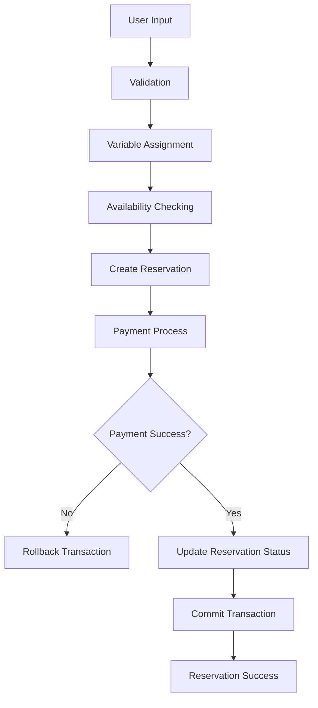

# 🔬 Data Flow Testing — Tempat-in Reservation System

**Mata Kuliah:** Software Quality Assurance  
**Pertemuan:** 10 — White Box Testing  
**Project:** Tempat-in  
**Model Pengujian:** Data Flow Testing  
**Modul Target:** Reservation Booking & Payment Data Process  
**Framework:** Laravel 12  
**Tingkat Kompleksitas:** 🔴 High

---

# 📖 Definisi & Konsep Dasar

**Data Flow Testing** merupakan teknik White Box Testing yang berfokus pada aliran data (*data flow*) dalam program, khususnya bagaimana variabel:

- didefinisikan
- digunakan
- dimodifikasi
- diproses
- menghasilkan output

Tujuan utama teknik ini adalah memastikan bahwa seluruh data pada sistem diproses dengan benar dan tidak menghasilkan:

- undefined variable
- invalid state
- inconsistent data
- logical data error
- unused variable

Pada sistem Tempat-in, Data Flow Testing sangat penting karena aplikasi memproses data transaksi reservasi dan pembayaran yang bersifat kritikal.

---

# 🎯 Tujuan Pengujian

Pengujian difokuskan pada:
## Reservation Booking & Payment Flow

Tujuan:

- ✅ Memastikan data reservasi diproses dengan benar
- ✅ Memvalidasi penggunaan variabel booking
- ✅ Memastikan data payment tidak corrupt
- ✅ Menguji perubahan status reservation
- ✅ Memastikan transaction rollback menjaga konsistensi data

---

# 💻 Kode Sumber — Reservation Data Process

```php
public function store(Request $request) // Node 1
{
    $validated = $request->validate([ // Node 2
        'table_id' => 'required',
        'reservation_date' => 'required',
        'reservation_time' => 'required',
        'total_price' => 'required|numeric'
    ]);

    $tableId = $request->table_id; // Node 3
    $date = $request->reservation_date; // Node 4
    $time = $request->reservation_time; // Node 5
    $totalPrice = $request->total_price; // Node 6

    $isBooked = Reservation::where('table_id', $tableId)
        ->where('reservation_date', $date)
        ->where('reservation_time', $time)
        ->exists(); // Node 7

    if ($isBooked) { // Node 8
        return back()->with('error', 'Meja sudah dibooking'); // Node 9
    }

    DB::beginTransaction(); // Node 10

    $reservation = Reservation::create([ // Node 11
        'user_id' => auth()->id(),
        'table_id' => $tableId,
        'reservation_date' => $date,
        'reservation_time' => $time,
        'total_price' => $totalPrice,
        'status' => 'pending'
    ]);

    $paymentSuccess = $this->midtransService
        ->createTransaction($reservation); // Node 12

    if (!$paymentSuccess) { // Node 13
        DB::rollBack(); // Node 14
        return back()->with('error', 'Payment gagal');
    }

    $reservation->status = 'confirmed'; // Node 15
    $reservation->save(); // Node 16

    DB::commit(); // Node 17

    return redirect()->route('reservation.success'); // Node 18
}
```

---

# 🗺️ Analisis Data Flow

## Variabel Utama

| Variabel | Definisi | Penggunaan |
|---|---|---|
| `$tableId` | input request | pengecekan availability + insert reservation |
| `$date` | input request | pengecekan jadwal |
| `$time` | input request | pengecekan jadwal |
| `$totalPrice` | input request | transaksi pembayaran |
| `$reservation` | hasil create reservation | payment transaction + update status |
| `$paymentSuccess` | hasil Midtrans API | kontrol transaction |

---

# 🔄 Data Flow Diagram



---

# 🛣️ Analisis DU Path (Define-Use Path)

| Variabel | Define | Use | Status |
|---|---|---|---|
| `$tableId` | Node 3 | Node 7, Node 11 | ✅ Valid |
| `$date` | Node 4 | Node 7, Node 11 | ✅ Valid |
| `$time` | Node 5 | Node 7, Node 11 | ✅ Valid |
| `$totalPrice` | Node 6 | Node 11 | ✅ Valid |
| `$reservation` | Node 11 | Node 12, Node 15 | ✅ Valid |
| `$paymentSuccess` | Node 12 | Node 13 | ✅ Valid |

---

# 🧪 Tabel Test Case

| TC | Variabel | Kondisi | Expected Result |
|---|---|---|---|
| TC-01 | `$tableId` | meja sudah dibooking | reservation gagal |
| TC-02 | `$totalPrice` | total_price kosong | validation error |
| TC-03 | `$reservation` | payment gagal | rollback berhasil |
| TC-04 | `$paymentSuccess` | payment success | status confirmed |
| TC-05 | `$reservation->status` | payment success | data berubah menjadi confirmed |

---

# 💻 Contoh PHPUnit Testing

```php
public function test_data_flow_reservation_status_updated_after_payment()
{
    $response = $this->post('/reservation', [
        'table_id' => 1,
        'reservation_date' => '2026-05-20',
        'reservation_time' => '19:00',
        'total_price' => 150000
    ]);

    $this->assertDatabaseHas('reservations', [
        'table_id' => 1,
        'status' => 'confirmed'
    ]);
}
```

---

# 📊 Hasil Pengujian

| TC | Fokus Pengujian | Status |
|---|---|---|
| TC-01 | Data availability booking | ✅ PASS |
| TC-02 | Validation data | ✅ PASS |
| TC-03 | Rollback consistency | ✅ PASS |
| TC-04 | Payment flow | ✅ PASS |
| TC-05 | Status update | ✅ PASS |

---

# 📊 Analisis Hasil

## Temuan

| No | Temuan | Status |
|---|---|---|
| 1 | Seluruh variabel memiliki define-use jelas | ✅ |
| 2 | Tidak ditemukan unused variable | ✅ |
| 3 | Flow payment menjaga konsistensi data | ✅ |
| 4 | Rollback berhasil mencegah corrupt data | ✅ |
| 5 | Potensi race condition masih ada | ⚠️ |

---

# ⚠️ Risiko yang Ditemukan

## Concurrent Data Access

Kemungkinan:
- dua request mengakses data meja yang sama
- availability checking lolos bersamaan
- menyebabkan inconsistent reservation data

Rekomendasi:

```php
lockForUpdate()
```

atau:

```sql
UNIQUE(table_id, reservation_date, reservation_time)
```

---

# ⚖️ Kelebihan & Kekurangan

## Kelebihan

| No | Kelebihan |
|---|---|
| 1 | Memastikan aliran data konsisten |
| 2 | Mendeteksi penggunaan variabel tidak valid |
| 3 | Efektif untuk aplikasi transactional |
| 4 | Mengurangi risiko corrupt data |

---

## Kekurangan

| No | Kekurangan |
|---|---|
| 1 | Kompleks pada sistem besar |
| 2 | Membutuhkan analisis variable detail |
| 3 | Tidak fokus pada performa sistem |

---

# 🛠️ Tools Pengujian

| Tool | Fungsi |
|---|---|
| PHPUnit | Unit Testing |
| Laravel HTTP Test | Request simulation |
| Xdebug | Coverage analysis |
| Larastan | Static analysis |
| Mermaid | Data flow visualization |

---

# 📚 Referensi

1. Suprihadi, D. (2025). *Materi White Box Testing*. Universitas Kebangsaan Republik Indonesia.
2. Pressman, R. S. (2020). *Software Engineering: A Practitioner's Approach*.
3. McCabe, T. J. (1976). *A Complexity Measure*. IEEE Transactions on Software Engineering.
4. Andriyadi, A. (2022). *Evaluasi Sistem Informasi dengan White Box Testing*.

---

**Dokumentasi Data Flow Testing — Tempat-in**

*"Reliable systems depend on reliable data flow."*

