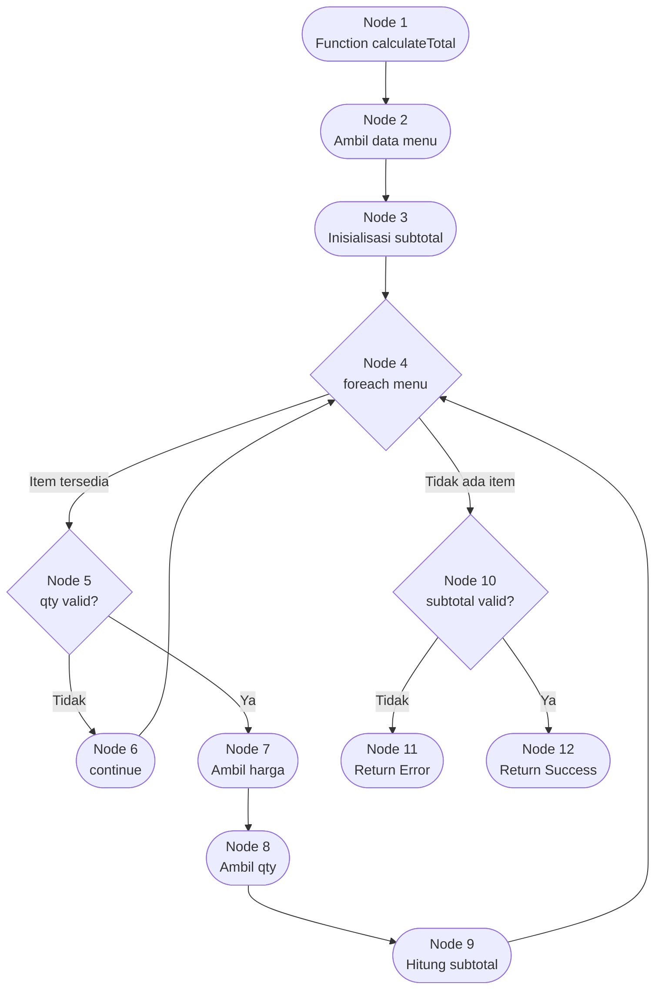

# 🔬 Loop Testing — Tempat-in Reservation System

**Mata Kuliah:** Software Quality Assurance  
**Pertemuan:** 10 — White Box Testing  
**Project:** Tempat-in  
**Model Pengujian:** Loop Testing  
**Modul Target:** Reservation & Menu Iteration Process  
**Framework:** Laravel 12  
**Tingkat Kompleksitas:** 🟡 Medium

---

# 📖 Definisi & Konsep Dasar

**Loop Testing** merupakan teknik White Box Testing yang berfokus pada pengujian struktur perulangan (*looping structure*) dalam program.

Tujuan utama teknik ini adalah memastikan bahwa seluruh proses iterasi:

- berjalan sesuai logika
- tidak menghasilkan infinite loop
- tidak melewati data penting
- mampu menangani boundary iteration
- tetap stabil pada jumlah data besar

Loop Testing sangat penting pada sistem Tempat-in karena aplikasi memproses:

- daftar menu makanan
- daftar reservasi
- iterasi table availability
- transaksi item reservation
- dashboard reporting

---

# 🎯 Tujuan Pengujian

Pengujian difokuskan pada:
## Reservation Menu Processing

Tujuan:

- ✅ Memastikan iterasi menu berjalan benar
- ✅ Memastikan subtotal dihitung dengan benar
- ✅ Menguji kondisi loop kosong
- ✅ Menguji loop satu item dan multi item
- ✅ Memastikan tidak terjadi infinite loop

---

# 💻 Kode Sumber — Reservation Menu Loop

```php
public function calculateTotal(Request $request) // Node 1
{
    $menus = $request->menus; // Node 2

    $subtotal = 0; // Node 3

    foreach ($menus as $menu) { // Node 4 (Loop)

        if ($menu['qty'] <= 0) { // Node 5
            continue; // Node 6
        }

        $price = $menu['price']; // Node 7
        $qty = $menu['qty']; // Node 8

        $subtotal += ($price * $qty); // Node 9
    }

    if ($subtotal <= 0) { // Node 10
        return back()->with('error', 'Subtotal invalid'); // Node 11
    }

    return response()->json([ // Node 12
        'subtotal' => $subtotal
    ]);
}
```

---

# 🗺️ Struktur Loop



---

# 🔄 Jenis Loop yang Diuji

| Jenis Pengujian | Deskripsi |
|---|---|
| Zero Loop | Tidak ada item menu |
| Single Loop | Satu item menu |
| Multiple Loop | Banyak item menu |
| Invalid Loop | Qty invalid |
| Boundary Loop | Jumlah item maksimum |

---

# 🛣️ Jalur Loop Execution

| Flow | Jalur | Deskripsi |
|---|---|---|
| Flow 1 | N1 → N2 → N3 → N4 → N10 → N11 | Tidak ada menu |
| Flow 2 | N1 → N2 → N3 → N4 → N5 → N7 → N8 → N9 → N10 → N12 | Satu item valid |
| Flow 3 | N1 → N2 → N3 → N4 → N5 → N6 → N4 → N10 → N11 | Qty invalid |
| Flow 4 | N1 → N2 → N3 → N4 → N5 → N7 → N8 → N9 → N4 → N10 → N12 | Banyak item menu |

---

# 🧪 Tabel Test Case

| TC | Jenis Loop | Input | Expected Result |
|---|---|---|---|
| TC-01 | Zero Loop | menu kosong | subtotal invalid |
| TC-02 | Single Loop | 1 menu valid | subtotal berhasil dihitung |
| TC-03 | Invalid Loop | qty = 0 | item dilewati |
| TC-04 | Multiple Loop | banyak menu | subtotal akumulatif benar |
| TC-05 | Boundary Loop | 100 item menu | sistem tetap stabil |

---

# 💻 Contoh PHPUnit Testing

```php
public function test_loop_testing_multiple_menu_calculation()
{
    $response = $this->postJson('/reservation/calculate-total', [
        'menus' => [
            [
                'price' => 20000,
                'qty' => 2
            ],
            [
                'price' => 15000,
                'qty' => 3
            ]
        ]
    ]);

    $response->assertStatus(200)
             ->assertJson([
                 'subtotal' => 85000
             ]);
}
```

---

# 📊 Hasil Pengujian

| TC | Fokus Pengujian | Status |
|---|---|---|
| TC-01 | Zero loop | ✅ PASS |
| TC-02 | Single iteration | ✅ PASS |
| TC-03 | Invalid iteration | ✅ PASS |
| TC-04 | Multiple iteration | ✅ PASS |
| TC-05 | Boundary iteration | ✅ PASS |

---

# 📊 Analisis Hasil

## Temuan

| No | Temuan | Status |
|---|---|---|
| 1 | Loop berhenti sesuai kondisi | ✅ |
| 2 | Tidak ditemukan infinite loop | ✅ |
| 3 | Akumulasi subtotal berjalan benar | ✅ |
| 4 | Invalid qty berhasil dilewati | ✅ |
| 5 | Sistem stabil pada multiple iteration | ✅ |

---

# ⚠️ Risiko yang Ditemukan

## Large Data Iteration

Jika jumlah menu sangat besar:

- penggunaan memory meningkat
- response menjadi lebih lambat
- query processing dapat membebani server

Rekomendasi:

```php
chunk()
```

atau:

```php
lazyCollection()
```

untuk optimasi iterasi data besar.

---

# ⚖️ Kelebihan & Kekurangan

## Kelebihan

| No | Kelebihan |
|---|---|
| 1 | Memastikan iterasi berjalan benar |
| 2 | Efektif mendeteksi infinite loop |
| 3 | Menguji boundary iteration |
| 4 | Cocok untuk aplikasi data processing |

---

## Kekurangan

| No | Kekurangan |
|---|---|
| 1 | Tidak fokus pada business logic kompleks |
| 2 | Tidak mendeteksi concurrency issue |
| 3 | Kurang efektif untuk modul non-looping |

---

# 🛠️ Tools Pengujian

| Tool | Fungsi |
|---|---|
| PHPUnit | Unit testing |
| Laravel HTTP Test | Request simulation |
| Xdebug | Coverage analysis |
| Mermaid | Visualisasi loop flow |
| Larastan | Static analysis |

---

# 📚 Referensi

1. Suprihadi, D. (2025). *Materi White Box Testing*. Universitas Kebangsaan Republik Indonesia.
2. Pressman, R. S. (2020). *Software Engineering: A Practitioner's Approach*.
3. McCabe, T. J. (1976). *A Complexity Measure*. IEEE Transactions on Software Engineering.
4. Andriyadi, A. (2022). *Evaluasi Sistem Informasi dengan White Box Testing*.

---

**Dokumentasi Loop Testing — Tempat-in**

*"Efficient loops produce efficient systems."*

